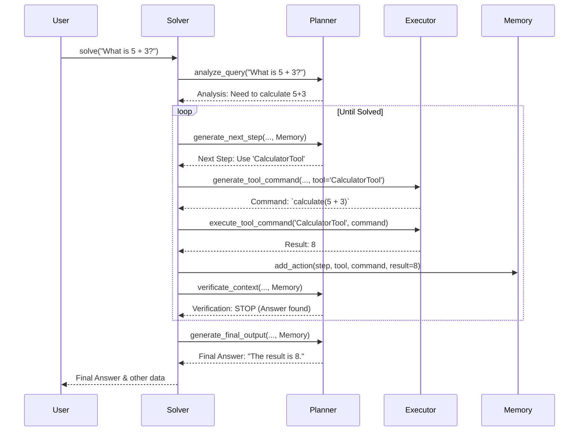

# Chapter 1: Solver

Welcome to the `octotools` tutorial! We're excited to guide you through building powerful problem-solving agents. This is the very first chapter, so we'll start with the big picture.

Imagine you have a question, maybe something simple like "What's the capital of France?" or something more complex that might even involve looking at an image. How does a computer program figure out the answer, especially if it needs multiple steps or different "tools" (like searching the web or doing calculations)?

That's where the **Solver** comes in. It's the main coordinator, the "brain" of the operation, that manages the entire process of answering your question.

## What is the Solver?

Think of the `Solver` like a **Project Manager** for answering your query. You (the user) give the Project Manager a task (your question, maybe with an image). The Project Manager doesn't necessarily know *how* to do everything itself, but it knows who to ask and how to guide the process.

It coordinates several specialist components:

1.  **[Planner](05_planner_.md):** This is like the strategist. It looks at the main goal (your query) and decides *what* needs to happen next. Should we search the web? Should we analyze the image? It breaks the big problem down into smaller steps.
2.  **[Executor](06_executor_.md):** This is the hands-on specialist. Once the Planner decides *what* tool to use (e.g., a Web Search tool), the Executor figures out the exact command for that tool and then runs it.
3.  **[Memory](04_memory_.md):** This is the project logbook. It keeps track of all the steps taken, the results found, and the overall progress. This helps the Planner make better decisions as the process unfolds.

The `Solver` uses these components, directing them like an orchestra conductor, until it finds a final answer or reaches a predefined limit (like a maximum number of steps or time allowed).

## How to Use the Solver (A Simple Example)

Let's see how you might use the `Solver` in your code. `octotools` provides a handy function `construct_solver` to set everything up easily.

```python
# Import the function to build a solver
from octotools.solver import construct_solver

# --- Parameters ---
# Define which LLM engine to use (we'll learn more later)
llm_engine = "gpt-4o" # Example engine
# Specify which tools the solver can use (we'll cover tools later)
# For now, let's imagine a simple tool exists
tools_to_use = ["Simple_Calculator_Tool"]
# Should the solver print detailed steps as it works?
show_details = True

# --- Create the Solver ---
# This function sets up the Planner, Executor, Memory, and Solver itself
my_solver = construct_solver(
    llm_engine_name=llm_engine,
    enabled_tools=tools_to_use,
    verbose=show_details
)

# --- Ask a Question ---
question = "What is 5 + 3?"
print(f"Asking the Solver: {question}")

# --- Get the Answer ---
# This is where the magic happens!
result_data = my_solver.solve(question)

# --- See the Result ---
# The solver returns a dictionary with details, including the final answer
print("\nSolver finished!")
# We'll focus on the 'direct_output' for the final answer
print(f"Final Answer: {result_data.get('direct_output', 'Not found')}")
```

**Explanation:**

1.  We import `construct_solver`.
2.  We decide which AI model ([LLM Engine](02_llm_engine_.md)) and which [Tool](03_tool_.md)s the Solver can use. `verbose=True` means it will print out its thinking process.
3.  `construct_solver(...)` builds the `Solver` instance (`my_solver`), automatically creating the necessary [Planner](05_planner_.md), [Executor](06_executor_.md), and [Memory](04_memory_.md) behind the scenes.
4.  We define our `question`.
5.  We call the `my_solver.solve(question)` method. This starts the whole problem-solving process.
6.  The `solve` method returns a dictionary containing various pieces of information, including intermediate steps and the final answer (often found in `direct_output`).

If you run this (assuming you have the necessary setup), you'd see the Solver potentially reasoning about using a calculator and then providing the answer "8".

## Under the Hood: The Solving Process

What actually happens when you call `my_solver.solve()`? The `Solver` follows a structured workflow:

1.  **Receive Query:** The `Solver` gets your question (and maybe an image).
2.  **Analyze Query:** It asks the [Planner](05_planner_.md) to analyze the query and understand the main goal.
3.  **Loop Starts:** The `Solver` enters a loop, taking steps to solve the problem.
4.  **Plan Next Step:** Inside the loop, it asks the [Planner](05_planner_.md) (using the current [Memory](04_memory_.md)) to decide the *next* action (e.g., "Use the Calculator Tool to find 5+3").
5.  **Generate Command:** It tells the [Executor](06_executor_.md) to generate the specific command for the chosen tool (e.g., `calculator.add(5, 3)`).
6.  **Execute Command:** It asks the [Executor](06_executor_.md) to run the command using the appropriate [Tool](03_tool_.md).
7.  **Record in Memory:** The `Solver` records the action taken, the command used, and the result obtained in the [Memory](04_memory_.md).
8.  **Verify:** It asks the [Planner](05_planner_.md) to check the [Memory](04_memory_.md) – have we achieved the goal? Is the answer found?
9.  **Loop or Stop:** If the goal isn't met, the loop continues (back to step 4). If the goal *is* met (or limits like max steps/time are reached), the loop stops.
10. **Generate Final Output:** The `Solver` asks the [Planner](05_planner_.md) one last time to formulate the final answer based on everything in the [Memory](04_memory_.md).
11. **Return Result:** The `Solver` returns the collected information, including the final answer.

Here's a simplified diagram showing this flow:



## Diving Deeper into the Code (`octotools/solver.py`)

Let's peek at the `Solver`'s code itself. Don't worry, we'll keep it simple!

**1. Initialization (`__init__`)**

When a `Solver` object is created (usually by `construct_solver`), it stores references to the key components it needs to manage.

```python
# Simplified from octotools/solver.py
class Solver:
    def __init__(
        self,
        planner, # The Planner instance
        memory,  # The Memory instance
        executor, # The Executor instance
        output_types: str = "base,final,direct", # What kind of answers to generate
        max_steps: int = 10,    # Max steps before giving up
        max_time: int = 300,    # Max time (seconds) before giving up
        verbose: bool = True    # Print details?
        # ... other parameters skipped for simplicity
    ):
        self.planner = planner
        self.memory = memory
        self.executor = executor
        self.max_steps = max_steps
        self.max_time = max_time
        self.verbose = verbose
        # ... store other parameters
```

**Explanation:** The `__init__` method is like a setup checklist. It takes the pre-built `planner`, `memory`, and `executor` objects and saves them inside the `Solver` instance (using `self.planner`, `self.memory`, etc.). It also stores configuration settings like `max_steps`.

**2. The Solving Method (`solve`)**

This is the main engine. We'll look at a highly simplified version of the core loop.

```python
# Simplified from octotools/solver.py
class Solver:
    # ... __init__ method from above ...

    def solve(self, question: str, image_path: Optional[str] = None):
        # ... initial setup: record question, start timer ...
        if self.verbose:
            print(f"\n==> 🔍 Received Query: {question}")

        # [1] Analyze query (using the Planner)
        query_analysis = self.planner.analyze_query(question, image_path)
        if self.verbose:
            print(f"\n==> 🔍 Step 0: Query Analysis\n{query_analysis}")

        step_count = 0
        # --- Main Loop ---
        while step_count < self.max_steps: # Simplified loop condition
            step_count += 1
            if self.verbose:
                print(f"\n==> Starting Step {step_count}")

            # [2] Generate next step (using Planner)
            next_step_details = self.planner.generate_next_step(
                question, image_path, query_analysis, self.memory, step_count, self.max_steps
            )
            # ... extract tool_name, sub_goal from next_step_details ...
            tool_name = "ExampleTool" # Simplified for tutorial
            sub_goal = "Perform an example action" # Simplified

            # [3] Generate tool command (using Executor)
            command_details = self.executor.generate_tool_command(
                question, image_path, ..., tool_name, ... # Simplified args
            )
            # ... extract command from command_details ...
            command = "example_command()" # Simplified

            # [4] Execute the command (using Executor)
            result = self.executor.execute_tool_command(tool_name, command)

            # Update memory
            self.memory.add_action(step_count, tool_name, sub_goal, command, result)

            # [5] Verify if we should stop (using Planner)
            verification_details = self.planner.verificate_context(
                question, image_path, query_analysis, self.memory
            )
            # ... extract conclusion ('STOP' or 'CONTINUE') ...
            conclusion = "STOP" # Simplified for tutorial

            if conclusion == 'STOP':
                break # Exit the loop

        # --- Loop Finished ---

        # [6] Generate final answer (using Planner)
        final_answer = self.planner.generate_direct_output(question, image_path, self.memory)
        if self.verbose:
             print(f"\n==> 🐙 Final Answer:\n\n{final_answer}")

        # ... package final_answer and other data into a dictionary ...
        return {"direct_output": final_answer, ...} # Simplified return
```

**Explanation:**

*   The `solve` method takes the `question` (and optionally `image_path`).
*   It first calls `self.planner.analyze_query` to understand the goal.
*   It then enters a `while` loop that runs until `max_steps` are reached or the `Planner` decides to `STOP`.
*   Inside the loop:
    *   `self.planner.generate_next_step` decides what to do.
    *   `self.executor.generate_tool_command` creates the specific instruction.
    *   `self.executor.execute_tool_command` runs the instruction.
    *   `self.memory.add_action` records what happened.
    *   `self.planner.verificate_context` checks if the problem is solved.
*   After the loop, `self.planner.generate_direct_output` creates the final answer based on the history in `self.memory`.
*   Finally, it returns the results.

You can see how the `Solver` acts as the central coordinator, calling methods on the [Planner](05_planner_.md), [Executor](06_executor_.md), and [Memory](04_memory_.md) in a specific sequence to achieve the goal.

## Conclusion

The `Solver` is the heart of `octotools`, orchestrating the entire problem-solving process. It acts like a project manager, taking your query and coordinating the specialized skills of the [Planner](05_planner_.md) (the strategist), the [Executor](06_executor_.md) (the action-taker), and the [Memory](04_memory_.md) (the logbook) to arrive at a solution.

Understanding the `Solver`'s role is crucial because it ties all the other pieces together. You've seen how to create and use a basic `Solver` and gotten a glimpse into its internal workflow.

## Next Steps

Now that you understand the overall coordinator, let's dive into one of the key technologies that powers the reasoning capabilities of the Planner and Executor: the Large Language Model (LLM).

Ready to learn more? Let's proceed to the next chapter: **[LLM Engine](02_llm_engine_.md)**.

---

Generated by [AI Codebase Knowledge Builder](https://github.com/The-Pocket/Tutorial-Codebase-Knowledge)