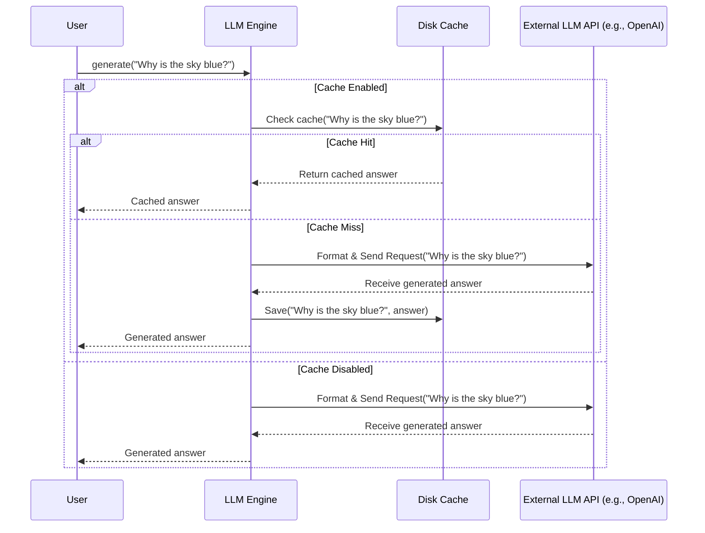

# Chapter 2: LLM Engine

Welcome back! In [Chapter 1: Solver](01_solver_.md), we learned about the `Solver`, the project manager that coordinates the whole process of answering your query. We saw that the `Solver` relies on components like the [Planner](05_planner_.md) and [Executor](06_executor_.md) to figure out *what* to do and *how* to do it.

But where does the actual "thinking" or "reasoning" happen? How does the [Planner](05_planner_.md) decide which step to take next? How does the [Executor](06_executor_.md) understand how to use a tool based on a natural language request? They need access to powerful AI!

This is where the **LLM Engine** comes in.

## What is the LLM Engine?

Think of the **LLM Engine** as your **direct phone line to different AI brains**. These "brains" are Large Language Models (LLMs) like OpenAI's GPT series (GPT-4, GPT-4o), Anthropic's Claude series, Google's Gemini, and many others.

The `LLM Engine` is a component within `octotools` that handles all the tricky details of talking to these different AI models:

1.  **Connection:** It knows *how* to connect to the specific API (Application Programming Interface) of each LLM provider (like OpenAI, Anthropic, etc.).
2.  **Communication:** It formats your request (like a question or a command) in the exact way the chosen LLM expects and sends it off.
3.  **Translation:** It takes the LLM's response (usually text, but sometimes structured data) and brings it back to your `octotools` program.
4.  **Reliability:** If the connection fails or the LLM is busy, the engine can automatically **retry** the request a few times.
5.  **Efficiency:** It can **cache** results. If you ask the *exact* same question again, it can pull the answer from memory (the cache) instead of contacting the LLM, saving time and potentially money.
6.  **Flexibility:** `octotools` supports various LLMs. A special helper called a **Factory** helps create the correct engine instance just by knowing the name of the model you want to use (e.g., `"gpt-4o"` or `"claude-3-haiku-20240307"`).

Essentially, the `LLM Engine` acts as an adapter and communication manager, allowing the rest of `octotools` (like the [Planner](05_planner_.md) and [Executor](06_executor_.md)) to use the intelligence of LLMs without worrying about the low-level technical details.

## How to Use It (The Factory)

You usually won't create an `LLM Engine` directly. Instead, you'll use the handy `create_llm_engine` function (the "Factory") provided by `octotools`. You just tell it which model you want, and it builds the correct engine object for you.

Let's try asking an AI a simple question.

```python
# Import the factory function
from octotools.engine.factory import create_llm_engine

# --- Configuration ---
# Specify the model name (e.g., from OpenAI, Anthropic, Google etc.)
# Make sure you have the necessary API key set as an environment variable!
# (e.g., OPENAI_API_KEY for OpenAI models)
model_name = "gpt-4o-mini-2024-07-18" # Example: Using an OpenAI model

# --- Create the Engine ---
# The factory figures out which engine class to use based on the name
print(f"Creating engine for model: {model_name}")
llm_engine = create_llm_engine(
    model_string=model_name,
    use_cache=True # Let's enable caching!
)
print("Engine created!")

# --- Ask the Engine a Question ---
question = "Explain what an LLM Engine is in one sentence."
print(f"\nAsking the engine: {question}")

# Use the engine's 'generate' method
# This sends the question to the actual LLM (like GPT-4o mini)
response = llm_engine.generate(question)

# --- See the Result ---
print("\nEngine Response:")
print(response)

# --- Ask Again (Check Cache) ---
print(f"\nAsking the *same* question again: {question}")
# This time, if caching worked, it should be much faster!
response_cached = llm_engine.generate(question)
print("\nEngine Response (should be from cache):")
print(response_cached)
```

**Explanation:**

1.  We import `create_llm_engine`.
2.  We specify the `model_name` we want to use. **Important:** Using different LLMs often requires setting up API keys as environment variables (like `OPENAI_API_KEY`, `ANTHROPIC_API_KEY`, `GOOGLE_API_KEY` etc.). Check the documentation for the specific LLM provider you want to use.
3.  `create_llm_engine(model_string=model_name, use_cache=True)` creates the engine instance. Because we set `use_cache=True`, it will try to save and retrieve results.
4.  We call `llm_engine.generate(question)`. This is the main way to interact with the engine. It sends the `question` to the configured LLM (GPT-4o mini in this case).
5.  The first time, the engine contacts the LLM API, gets the response, prints it, and saves it to the cache.
6.  The second time we call `generate` with the *exact same question*, the engine finds the previous answer in its cache and returns it directly, without needing to contact the LLM API again. This is usually much faster.

*(Note: The exact text of the response will vary depending on the LLM used and when you run it.)*

## Under the Hood

What happens when you call `llm_engine.generate()`?

**1. The Journey of a Request:**

Imagine you call `my_engine.generate("Why is the sky blue?")`.

1.  **Cache Check:** If caching is enabled (`use_cache=True`), the engine first creates a unique key based on the prompt ("Why is the sky blue?") and any other settings. It checks its local cache (usually a file on your disk) to see if it already has an answer stored for this exact key.
2.  **Cache Hit:** If the answer is found in the cache, the engine immediately returns the stored answer. Fast and efficient!
3.  **Cache Miss:** If the answer is *not* in the cache (or caching is disabled):
    *   **Format Request:** The engine takes your prompt and formats it into the specific structure required by the target LLM's API (e.g., for OpenAI, it might create a JSON object with roles like "system" and "user").
    *   **API Call:** It sends this formatted request over the internet to the LLM provider's server (e.g., api.openai.com).
    *   **Wait & Retry:** It waits for the LLM to process the request and send back a response. If there's a temporary network error or the API is busy, the engine might automatically wait a bit and try sending the request again (this is the "retry" mechanism).
    *   **Receive Response:** The engine receives the response (the generated text) from the LLM API.
    *   **Save to Cache:** If caching is enabled, the engine now saves the received answer in its cache, using the key generated in step 1.
    *   **Return Response:** Finally, the engine returns the generated text to your code.

Here's a diagram showing this flow:



**2. Code Dive:**

Let's peek at some relevant code snippets.

*   **The Factory (`octotools/engine/factory.py`):** This function acts like a switchboard, directing the creation process to the right engine class based on the `model_string`.

    ```python
    # Simplified from octotools/engine/factory.py
    from typing import Any

    def create_llm_engine(model_string: str, use_cache: bool = False, **kwargs) -> Any:
        """
        Factory function to create appropriate LLM engine instance.
        """
        if "gpt" in model_string: # Check if it's an OpenAI model
            from .openai import ChatOpenAI
            # Create an OpenAI engine instance
            return ChatOpenAI(model_string=model_string, use_cache=use_cache, **kwargs)

        elif "claude" in model_string: # Check if it's an Anthropic model
            from .anthropic import ChatAnthropic
            # Create an Anthropic engine instance
            return ChatAnthropic(model_string=model_string, use_cache=use_cache, **kwargs)

        elif "gemini" in model_string: # Check if it's a Google model
            from .gemini import ChatGemini
            # Create a Gemini engine instance
            return ChatGemini(model_string=model_string, use_cache=use_cache, **kwargs)

        # ... other elif blocks for different model types ...

        else:
            raise ValueError(f"Engine {model_string} not supported.")
    ```
    **Explanation:** The factory uses simple checks (`if/elif`) on the `model_string` to determine which specific engine class (like `ChatOpenAI`, `ChatAnthropic`) to import and instantiate.

*   **Base Classes (`octotools/engine/base.py`):** These define the common structure and features. `EngineLM` defines what all engines *must* do (like have a `generate` method), and `CachedEngine` provides the caching logic.

    ```python
    # Simplified from octotools/engine/base.py
    from abc import ABC, abstractmethod
    import diskcache as dc
    import hashlib

    class EngineLM(ABC): # Abstract Base Class
        @abstractmethod # Means subclasses MUST implement this
        def generate(self, prompt, **kwargs):
            pass # No implementation here, just defines the requirement

    class CachedEngine:
        def __init__(self, cache_path):
            self.cache_path = cache_path
            # Uses the 'diskcache' library for file-based caching
            self.cache = dc.Cache(cache_path)

        def _check_cache(self, prompt: str):
            # Creates a unique hash for the prompt to use as a key
            cache_key = hashlib.sha256(f"{prompt}".encode()).hexdigest()
            if cache_key in self.cache:
                print("CACHE HIT!") # Useful for debugging
                return self.cache[cache_key] # Return saved value
            return None # Not found in cache

        def _save_cache(self, prompt: str, response: str):
            cache_key = hashlib.sha256(f"{prompt}".encode()).hexdigest()
            self.cache[cache_key] = response # Save value to disk cache
            print("SAVED TO CACHE.")
        # ... other cache related methods ...
    ```
    **Explanation:** `EngineLM` ensures all engines have a consistent `generate` method. `CachedEngine` provides reusable functions (`_check_cache`, `_save_cache`) that specific engines can use if `use_cache=True`. It uses the `diskcache` library to handle the details of saving/loading from files.

*   **Specific Engine (`octotools/engine/openai.py`):** Here's a simplified look at how `ChatOpenAI` might implement `generate`.

    ```python
    # Simplified from octotools/engine/openai.py
    from .base import EngineLM, CachedEngine
    from openai import OpenAI # OpenAI's library
    from tenacity import retry, wait_random_exponential, stop_after_attempt
    import os

    class ChatOpenAI(EngineLM, CachedEngine): # Inherits from both base classes
        def __init__(self, model_string, use_cache=True, **kwargs):
            self.model_string = model_string
            self.use_cache = use_cache
            if self.use_cache:
                # Setup caching using the parent CachedEngine's __init__
                cache_path = f"cache_openai_{model_string}.db" # Example path
                super().__init__(cache_path=cache_path)
            # Setup the connection to OpenAI using the API key from environment variables
            self.client = OpenAI(api_key=os.getenv("OPENAI_API_KEY"))
            # ... other setup ...

        # Decorator to automatically retry on failure
        @retry(wait=wait_random_exponential(min=1, max=5), stop=stop_after_attempt(3))
        def generate(self, prompt: str, system_prompt=None, **kwargs):
            # 1. Check Cache (if enabled)
            cache_key = (system_prompt or self.DEFAULT_SYSTEM_PROMPT) + prompt
            if self.use_cache:
                cached_result = self._check_cache(cache_key)
                if cached_result:
                    return cached_result # Return from cache if found

            # 2. Prepare API Call
            messages = [
                {"role": "system", "content": system_prompt or self.DEFAULT_SYSTEM_PROMPT},
                {"role": "user", "content": prompt}
            ]

            # 3. Make API Call
            response = self.client.chat.completions.create(
                model=self.model_string,
                messages=messages,
                # ... other parameters like temperature, max_tokens ...
            )
            result_text = response.choices[0].message.content

            # 4. Save to Cache (if enabled)
            if self.use_cache:
                self._save_cache(cache_key, result_text)

            # 5. Return Result
            return result_text
    ```
    **Explanation:**
    *   The class `ChatOpenAI` *inherits* features from `EngineLM` and `CachedEngine`.
    *   The `__init__` method sets up the specific client (using the `openai` library and an API key) and initializes the cache if needed.
    *   The `@retry(...)` decorator automatically handles retrying the `generate` function if it fails (e.g., due to temporary network issues).
    *   The `generate` method follows the logic: check cache, prepare the API request in OpenAI's format, make the call using `self.client`, save the result to cache, and return it.

## Conclusion

The `LLM Engine` is the powerhouse connection in `octotools`. It bridges the gap between your code and the sophisticated reasoning abilities of various Large Language Models like GPT, Claude, and Gemini. By handling API calls, retries, and caching, it lets the rest of the framework focus on higher-level tasks like planning and execution. The `create_llm_engine` factory makes it easy to switch between different AI "brains".

You now understand how `octotools` gets its core intelligence!

## Next Steps

Having an intelligent engine is great, but how do we give it specific capabilities beyond just talking? What if we want it to search the web, perform calculations, or interact with other software? For that, we need **Tools**.

Let's move on to the next chapter: **[Tool](03_tool_.md)**.

---

Generated by [AI Codebase Knowledge Builder](https://github.com/The-Pocket/Tutorial-Codebase-Knowledge)