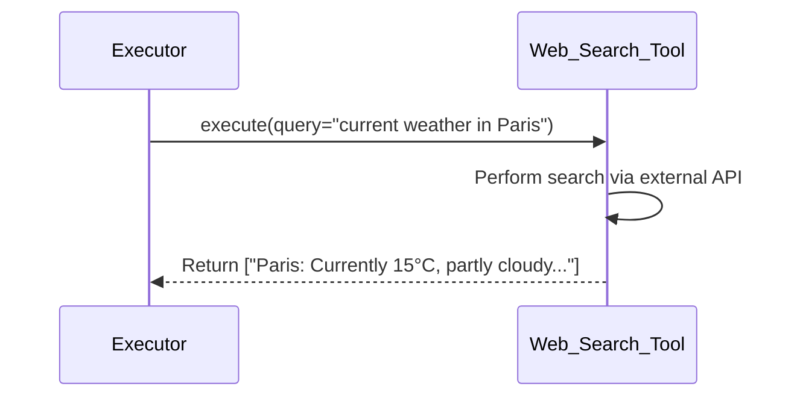

# Chapter 3: Tool

Hi there! In the previous chapter, we explored the **[LLM Engine](02_llm_engine_.md)**, the powerful AI brain that `octotools` uses for reasoning and understanding language. We saw how it connects to models like GPT-4o and allows us to ask questions.

But what if our question requires information the AI doesn't have built-in? For example, asking "What's the current weather in Paris?" or "What objects are in this specific image file?". The AI's knowledge might be outdated or it might not be able to "see" an image file on your computer directly. It needs *specialized capabilities*.

That's where **Tools** come in!

## What is a Tool?

Think of the `octotools` system like a very smart workshop manager ([Solver](01_solver_.md)) equipped with an advanced AI consultant ([LLM Engine](02_llm_engine_.md)). While the AI is brilliant, it can't physically *do* everything. It needs specialized equipment to perform specific tasks.

A **Tool** in `octotools` is exactly that: a **specialized piece of equipment** that provides a specific capability beyond the basic knowledge of the [LLM Engine](02_llm_engine_.md).

Examples of Tools include:

*   **Web Search Tool:** Can look up current information on the internet (like the weather in Paris).
*   **Image Captioner Tool:** Can look at an image file and generate a description.
*   **Object Detector Tool:** Can find specific objects within an image (like finding all the "cats" or "dogs").
*   **Code Execution Tool:** Can run simple pieces of code (like performing a calculation).
*   **ArXiv Paper Searcher Tool:** Can search for academic papers on the arXiv website.

Each tool is designed for a specific job. It has:

1.  **Defined Inputs:** What information does the tool need to do its job? (e.g., the Web Search tool needs a search query).
2.  **Defined Outputs:** What result does the tool produce? (e.g., the Web Search tool outputs a list of search results).
3.  **Metadata:** Information *about* the tool, like its name, a description of what it does, its version, and maybe some examples of how to use it. This helps the [Planner](05_planner_.md) understand which tool is right for a particular step.

The [Planner](05_planner_.md) acts like the strategist, deciding *which* tool is needed based on the problem. The [Executor](06_executor_.md) is the operator who actually figures out the specific command and runs the chosen tool.

## How are Tools Defined? (A Peek Under the Hood)

You generally won't *directly* use a tool yourself when running the main [Solver](01_solver_.md). The Solver, Planner, and Executor handle that coordination. However, understanding how a tool is defined helps grasp how `octotools` works.

Every tool in `octotools` is built using a template called `BaseTool`. Let's look at a simplified structure.

```python
# Simplified concept from octotools/tools/base.py

class BaseTool:
    """A base template for all tools."""
    def __init__(self, tool_name, tool_description, input_types, output_type, ...):
        """Sets up the tool's basic info (metadata)."""
        self.tool_name = tool_name
        self.tool_description = tool_description
        self.input_types = input_types # What goes in? (e.g., {"query": "text"})
        self.output_type = output_type # What comes out? (e.g., "list of results")
        # ... other metadata like version, examples ...
        print(f"Tool '{self.tool_name}' initialized!")

    def execute(self, *args, **kwargs):
        """The main function that performs the tool's action."""
        # Each specific tool MUST implement this method!
        raise NotImplementedError("This tool needs its own execute method.")

    def get_metadata(self):
        """Returns the tool's description and capabilities."""
        # ... code to gather metadata ...
        return {
            "tool_name": self.tool_name,
            "tool_description": self.tool_description,
            # ... other metadata ...
        }
```

**Explanation:**

1.  `BaseTool` is like a blueprint. All specific tools (like `Web_Search_Tool` or `Image_Captioner_Tool`) follow this pattern.
2.  The `__init__` method is called when a tool object is created. It stores the essential **metadata** (name, description, what inputs it needs, what output it produces). This metadata is crucial for the [Planner](05_planner_.md) to understand what the tool can do.
3.  The `execute` method is the core of the tool – it's where the actual work happens (like searching the web or analyzing an image). Each specific tool *must* provide its own version of `execute`.
4.  `get_metadata` is a helper function to retrieve the tool's descriptive information.

Now, let's imagine a very simplified `Web_Search_Tool`:

```python
# Simplified example inspired by octotools/tools/google_search/tool.py
from octotools.tools.base import BaseTool
import requests # Library to make web requests

class Web_Search_Tool(BaseTool):
    def __init__(self):
        # Call the parent's init to set up metadata
        super().__init__(
            tool_name="Web_Search_Tool",
            tool_description="Searches the web for information using a query.",
            input_types={"query": "str - The text to search for."},
            output_type="list - A list of search result snippets.",
            # ... other metadata ...
        )
        # Tool-specific setup (e.g., API keys - simplified here)
        self.search_engine_url = "https://example-search.com/api"

    def execute(self, query: str):
        """Performs the web search."""
        print(f"Web Search Tool: Searching for '{query}'...")
        try:
            # Make the actual request to a search engine API
            response = requests.get(self.search_engine_url, params={'q': query, 'results': 3})
            response.raise_for_status() # Check for errors
            data = response.json() # Get results as structured data
            # Extract relevant parts (simplified)
            results = [item.get('snippet', '') for item in data.get('items', [])]
            return results
        except Exception as e:
            print(f"Web Search Tool: Error - {e}")
            return [] # Return empty list on failure
```

**Explanation:**

1.  `Web_Search_Tool` *inherits* from `BaseTool`.
2.  Its `__init__` calls `super().__init__(...)` to set up the standard metadata (name, description, etc.) defined in `BaseTool`. It also might do some setup specific to this tool (like configuring the search engine URL).
3.  Its `execute` method takes the required input (`query`). It uses the `requests` library to contact an external search engine API, gets the results, extracts the useful parts (like snippets of text), and returns them as a list. It also includes basic error handling.

This structure makes it easy for `octotools` (specifically the [Executor](06_executor_.md)) to know how to run any tool: it just needs to call the `execute` method with the right inputs.

## How the Executor Uses a Tool

When the [Planner](05_planner_.md) decides that a web search is needed (e.g., for "What's the weather in Paris?"), the [Executor](06_executor_.md) takes over.

1.  The Executor identifies the correct tool object (e.g., the `Web_Search_Tool` instance).
2.  It figures out the exact arguments needed (e.g., `query="current weather in Paris"`).
3.  It calls the tool's `execute` method with those arguments.
4.  It receives the result back from the tool (e.g., a list of snippets like `["Paris: Currently 15°C, partly cloudy..."]`).

Here's a simple diagram showing this interaction:



## Tools That Need AI (`require_llm_engine`)

Some tools might need the help of an [LLM Engine](02_llm_engine_.md) themselves! For example, the `Image_Captioner_Tool` needs a powerful multimodal AI (like GPT-4o) to understand the image and generate text.

These tools have a special flag, `require_llm_engine = True`, set in their definition.

```python
# Simplified concept from octotools/tools/image_captioner/tool.py
from octotools.tools.base import BaseTool
# Assume create_llm_engine is available from Chapter 2
from octotools.engine.factory import create_llm_engine

class Image_Captioner_Tool(BaseTool):
    require_llm_engine = True # This tool needs an LLM!

    def __init__(self, model_string="gpt-4o-mini"):
        super().__init__(
            tool_name="Image_Captioner_Tool",
            tool_description="Generates captions for images.",
            input_types={"image_path": "str", "prompt": "str"},
            output_type="str - The generated caption.",
            # ... other metadata ...
        )
        # The framework can inject the LLM engine later,
        # or the tool can create it if needed.
        self.llm_engine = None # Placeholder
        self.model_string = model_string
        print(f"Image Captioner ready (will use model: {model_string})")

    def set_llm_engine(self, engine): # Method for the framework to provide the engine
        self.llm_engine = engine

    def execute(self, image_path: str, prompt: str = "Describe this image."):
        """Generates a caption using the LLM engine."""
        if not self.llm_engine:
            # If not set externally, create it now
            print("LLM Engine not set, creating one...")
            self.llm_engine = create_llm_engine(self.model_string, is_multimodal=True)

        print(f"Image Captioner: Processing '{image_path}' with prompt '{prompt}'...")
        try:
            # Prepare input for the multimodal LLM
            # (Simplified - involves reading image bytes)
            image_data = f"Image data from {image_path}" # Placeholder
            llm_input = [prompt, image_data]

            # Use the LLM Engine to generate the caption
            caption = self.llm_engine.generate(llm_input) # Or just self.llm_engine(llm_input)
            return caption
        except Exception as e:
            print(f"Image Captioner: Error - {e}")
            return "Error generating caption."

```

**Explanation:**

1.  `require_llm_engine = True` signals that this tool depends on an AI model.
2.  The `__init__` might store the *name* of the model to use (`model_string`).
3.  The `execute` method uses an instance of an [LLM Engine](02_llm_engine_.md) (`self.llm_engine`) to process the image and prompt, generating the final caption. The framework might provide this engine (using `set_llm_engine`), or the tool might create it itself if needed using the factory function we saw in Chapter 2.

## Conclusion

**Tools** are the extendable arms and senses of the `octotools` system. They allow the [Solver](01_solver_.md) to perform actions and gather information beyond the built-in capabilities of the [LLM Engine](02_llm_engine_.md). Whether it's searching the web, analyzing an image, or running code, each Tool provides a specific, well-defined function.

By understanding the concept of Tools and their structure (metadata + `execute` method), you can better appreciate how the [Planner](05_planner_.md) chooses the right capability and the [Executor](06_executor_.md) puts it into action.

## Next Steps

Now that we have an AI brain ([LLM Engine](02_llm_engine_.md)) and specialized equipment ([Tool](03_tool_.md)), how does the system keep track of what it has done and what it has learned along the way? If it uses a tool to find the weather, how does it remember that information for the next step?

That's the job of the **Memory**. Let's explore it in the next chapter: **[Memory](04_memory_.md)**.

---

Generated by [AI Codebase Knowledge Builder](https://github.com/The-Pocket/Tutorial-Codebase-Knowledge)