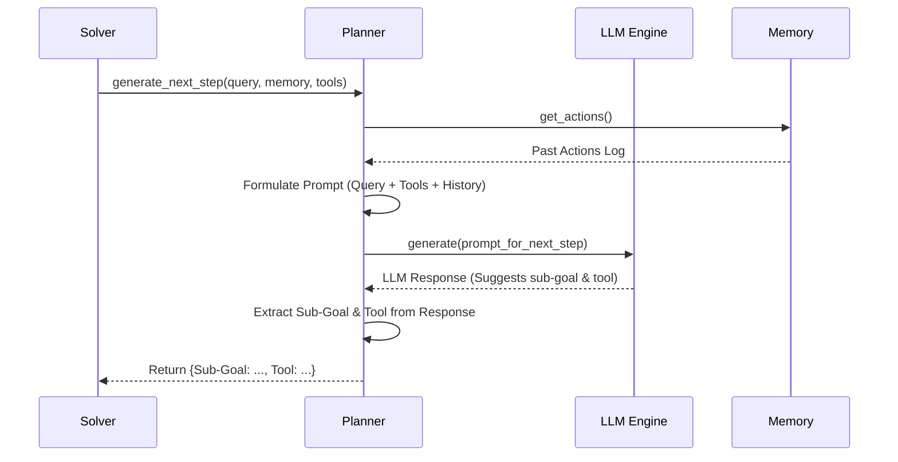

# Chapter 5: Planner

Welcome back! In [Chapter 4: Memory](04_memory_.md), we learned how `octotools` keeps a detailed logbook of everything it does and learns while solving a problem. This `Memory` is crucial because it provides the context needed for complex tasks.

But who actually *uses* this logbook to decide what to do next? If the goal is "Find the capital of France and then tell me its current weather," how does the system know to first search for the capital and *then* use that information to search for the weather? It needs a strategist!

That's the role of the **Planner**.

## What is the Planner?

Imagine you're planning a road trip. You have:

1.  **Your Destination:** The final goal (e.g., "Get to the Grand Canyon"). This is like the user's `query`.
2.  **Your Current Location & Trip Log:** Where you are now and where you've already been (e.g., "Just passed Flagstaff"). This is like the information stored in [Memory](04_memory_.md).
3.  **Your Map & Vehicle Options:** What routes are available and what modes of transport you have (e.g., "Highway map, local roads map, my car, maybe rent a bike?"). This is like the list of available [Tool](03_tool_.md)s and their descriptions.

The **Planner** is like the **Navigator** or **Strategist** on your trip. It looks at the destination, your current progress (from the logbook/memory), and the available routes/tools (your map), and decides:

*   **What's the very next step?** (e.g., "Drive west on Route 66 for 50 miles.") This is the **sub-goal**.
*   **Which tool/vehicle should I use for this step?** (e.g., "Use the car.") This is the **tool selection**.

So, the `Planner` is the strategic component in `octotools`. It analyzes the overall goal (the query), the history of what's been done ([Memory](04_memory_.md)), and the available capabilities ([Tool](03_tool_.md)s) to determine the most logical next action.

## Key Responsibilities of the Planner

The [Solver](01_solver_.md) relies on the `Planner` for several key decisions during the problem-solving process:

1.  **Analyzing the Query:** At the very beginning, the `Planner` reads the user's request (and looks at any provided images) to understand the main objective and break it down. (e.g., "The user wants two things: capital of France, then its weather.")
2.  **Generating the Next Step:** In each cycle of the [Solver](01_solver_.md)'s loop, the `Planner` looks at the current [Memory](04_memory_.md) and the overall goal, then decides the **sub-goal** for the *next* action and selects the best [Tool](03_tool_.md) to achieve it.
3.  **Verifying Completion:** After each step, the `Planner` checks the [Memory](04_memory_.md) again. Has the overall goal been achieved? Is all the necessary information gathered? It tells the [Solver](01_solver_.md) whether to `STOP` or `CONTINUE`.
4.  **Generating the Final Answer:** Once the `Planner` decides the task is complete (`STOP`), it reviews the entire journey recorded in [Memory](04_memory_.md) and formulates the final answer to present to the user.

Essentially, the `Planner` guides the entire process, making strategic choices at each stage.

## How the Planner Works (Under the Hood)

How does the `Planner` make these smart decisions? It doesn't just follow simple rules. It uses the power of the **[LLM Engine](02_llm_engine_.md)** (the AI brain we discussed in Chapter 2)!

The `Planner` works by creating specific questions (called **prompts**) and sending them to the [LLM Engine](02_llm_engine_.md). These prompts include all the relevant context: the original query, the list of available tools, their descriptions, and the current state of the [Memory](04_memory_.md).

**1. Non-Code Walkthrough: Planning the Next Step**

Let's imagine the [Solver](01_solver_.md) asks the `Planner` to decide the next step.

1.  **Gather Context:** The `Planner` gathers the original query ("What's the capital of France and its weather?"), the list of tools (e.g., `Web_Search_Tool`, `Weather_Tool`), and the current [Memory](04_memory_.md) (which might be empty initially, or might contain "Found capital: Paris").
2.  **Formulate Prompt:** It constructs a detailed prompt for the [LLM Engine](02_llm_engine_.md). This prompt essentially asks:
    *   "Here's the goal: [Query]"
    *   "Here are the tools I have: [Tool List & Descriptions]"
    *   "Here's what I've done so far: [Memory Contents]"
    *   "Based on all this, what is the single best **sub-goal** for the very next step, and which **tool** should I use to achieve it?"
3.  **Ask the AI:** The `Planner` sends this prompt to the [LLM Engine](02_llm_engine_.md).
4.  **Receive AI's Decision:** The [LLM Engine](02_llm_engine_.md) analyzes the prompt and provides a structured answer, like:
    *   Sub-Goal: "Find the current weather for Paris"
    *   Tool Name: "Weather_Tool"
5.  **Return Decision:** The `Planner` extracts this information (sub-goal and tool name) and gives it back to the [Solver](01_solver_.md).

The `Planner` uses this same "ask the AI" strategy for its other jobs too (analyzing the query, verifying completion, generating the final answer), just with different, carefully crafted prompts.

**2. Sequence Diagram: Planner Interaction**

This diagram shows how the [Solver](01_solver_.md) uses the `Planner`, which in turn uses the [LLM Engine](02_llm_engine_.md), to figure out the next step.



**3. Code Dive (`octotools/models/planner.py`)**

Let's look at simplified versions of the methods inside the `Planner` class.

*   **Initialization (`__init__`)**

    When a `Planner` is created (usually by `construct_solver`), it needs to know which AI model to use and what tools are available.

    ```python
    # Simplified from octotools/models/planner.py
    from octotools.engine.factory import create_llm_engine
    from octotools.models.memory import Memory
    from typing import List, Dict, Any

    class Planner:
        def __init__(self, llm_engine_name: str, toolbox_metadata: Dict = None, available_tools: List = None, verbose: bool = False):
            """Initializes the Planner."""
            self.llm_engine_name = llm_engine_name
            # Create an LLM engine instance using the factory
            self.llm_engine = create_llm_engine(
                model_string=llm_engine_name,
                is_multimodal=False # Planner usually deals with text
            )
            # Store info about available tools
            self.toolbox_metadata = toolbox_metadata if toolbox_metadata else {}
            self.available_tools = available_tools if available_tools else []
            self.verbose = verbose
            print(f"Planner initialized with LLM: {llm_engine_name}")
    ```
    **Explanation:** The `__init__` method saves the name of the [LLM Engine](02_llm_engine_.md) to use and creates an actual engine instance via the `create_llm_engine` factory we saw in Chapter 2. It also stores the list and descriptions (`metadata`) of the tools the [Solver](01_solver_.md) has access to.

*   **Generating the Next Step (`generate_next_step`)**

    This is where the core planning happens. It takes the context and asks the AI what to do next.

    ```python
    # Simplified from octotools/models/planner.py
    class Planner:
        # ... __init__ ...

        def generate_next_step(self, question: str, image: str, query_analysis: str, memory: Memory, step_count: int, max_step_count: int) -> Any:
            """Asks the LLM to decide the next sub-goal and tool."""

            # 1. Get current memory/history
            history = memory.get_actions()

            # 2. Create the prompt for the LLM
            prompt = f"""
Task: Decide the next step to solve the query.
Query: {question}
Available Tools: {self.available_tools}
Tool Info: {self.toolbox_metadata}
History: {history}
Current Step: {step_count}/{max_step_count}

Based on the history and the goal, what is the single best
sub-goal for the next step, and which *exact* tool name
from the list should be used?

Respond ONLY with:
Context: <brief context needed for tool>
Sub-Goal: <the specific goal for this step>
Tool Name: <exact tool name>
            """
            if self.verbose:
                print(f"Planner: Asking LLM for next step...")

            # 3. Call the LLM Engine
            # (Simplified - actual code might use structured output like response_format=NextStep)
            llm_response = self.llm_engine.generate(prompt)

            # 4. Extract the decision (simplified - actual code uses helper functions)
            # ... logic to parse sub_goal and tool_name from llm_response ...
            context = "Context extracted from LLM response" # Placeholder
            sub_goal = "Sub-goal extracted from LLM response" # Placeholder
            tool_name = "Tool name extracted from LLM response" # Placeholder

            if self.verbose:
                 print(f"Planner Decision: Tool='{tool_name}', Sub-Goal='{sub_goal}'")

            # Return the decision (could be a dictionary or a custom object)
            return {"context": context, "sub_goal": sub_goal, "tool_name": tool_name} # Simplified return
    ```
    **Explanation:**
    1.  It retrieves the action history from the [Memory](04_memory_.md).
    2.  It constructs a detailed `prompt` containing the query, tool info, history, and step count. The prompt explicitly asks the AI for the next sub-goal and tool name in a specific format.
    3.  It sends this prompt to the configured [LLM Engine](02_llm_engine_.md).
    4.  It receives the AI's text response and (in a real scenario) carefully extracts the sub-goal and tool name using parsing logic (like the `extract_context_subgoal_and_tool` helper method shown in the context).
    5.  It returns the extracted decision.

*   **Verifying Completion (`verificate_context`)**

    After a step, the Planner checks if the main goal is met.

    ```python
    # Simplified from octotools/models/planner.py
    class Planner:
        # ... __init__, generate_next_step ...

        def verificate_context(self, question: str, image: str, query_analysis: str, memory: Memory) -> Any:
            """Asks the LLM if the task is complete based on memory."""

            history = memory.get_actions()

            prompt = f"""
Task: Verify if the query is fully answered.
Query: {question}
History: {history}

Based *only* on the Query and the History provided, is the task
complete? Have all parts of the query been addressed by the
results in the history?

Respond ONLY with 'Conclusion: STOP' if complete,
or 'Conclusion: CONTINUE' if more steps are needed.

Explanation: <brief justification>
Conclusion: <STOP or CONTINUE>
            """
            if self.verbose:
                print(f"Planner: Asking LLM to verify completion...")

            # Call LLM (Simplified - actual code might use response_format=MemoryVerification)
            llm_response = self.llm_engine.generate(prompt)

            # Extract conclusion (Simplified - actual code uses helper like extract_conclusion)
            conclusion = "CONTINUE" # Default
            explanation = "Explanation from LLM" # Placeholder
            if "Conclusion: STOP" in llm_response:
                 conclusion = "STOP"

            if self.verbose:
                 print(f"Planner Verification: {conclusion}. Reason: {explanation}")

            # Return the verification result (could be a string or custom object)
            return {"explanation": explanation, "conclusion": conclusion} # Simplified
    ```
    **Explanation:** Similar to planning, it creates a prompt asking the [LLM Engine](02_llm_engine_.md) to evaluate the `history` against the `question`. The prompt specifically asks for a `STOP` or `CONTINUE` signal. The `Planner` extracts this signal from the AI's response and returns it to the [Solver](01_solver_.md).

*   **Generating Final Output (`generate_direct_output`)**

    Once the Planner signals `STOP`, the Solver asks it one last time to synthesize the final answer.

    ```python
    # Simplified from octotools/models/planner.py
    class Planner:
        # ... other methods ...

        def generate_direct_output(self, question: str, image: str, memory: Memory) -> str:
            """Asks the LLM to create the final answer from memory."""

            history = memory.get_actions()

            prompt = f"""
Task: Generate a final, concise answer to the query.
Query: {question}
History of Actions and Results: {history}

Based on the query and the entire history of actions taken and
their results, formulate a direct and clear answer to the original query.

Answer:
            """
            if self.verbose:
                print(f"Planner: Asking LLM to generate final answer...")

            # Call the LLM Engine
            final_answer_text = self.llm_engine.generate(prompt)

            if self.verbose:
                 print(f"Planner: Final answer generated.")

            return final_answer_text.strip()
    ```
    **Explanation:** This method sends the original question and the complete history to the [LLM Engine](02_llm_engine_.md), asking it to compose the final answer based on everything that was done and found. It then returns the AI-generated text.

## Conclusion

The **Planner** is the strategic brain of the `octotools` operation. It acts like a navigator, constantly assessing the goal (query), the journey so far ([Memory](04_memory_.md)), and the available routes ([Tool](03_tool_.md)s). By intelligently querying the [LLM Engine](02_llm_engine_.md), it guides the [Solver](01_solver_.md) by deciding on the next sub-goal, selecting the appropriate tool, determining when the task is finished, and finally compiling the overall answer. It bridges the gap between the high-level goal and the concrete actions needed to achieve it.

## Next Steps

We've seen how the `Planner` decides *what* needs to be done next and *which* tool to use. But how does the system actually *run* that tool with the correct instructions? That's the job of the component responsible for action.

Let's move on to the next chapter: **[Executor](06_executor_.md)**.

---

Generated by [AI Codebase Knowledge Builder](https://github.com/The-Pocket/Tutorial-Codebase-Knowledge)