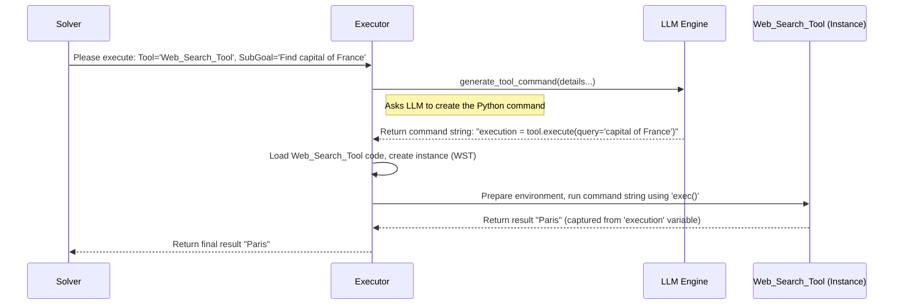

# Chapter 6: Executor

Welcome back! In [Chapter 5: Planner](05_planner_.md), we met the "Strategist" of `octotools`. The `Planner` looks at the overall goal (your query), the history ([Memory](04_memory_.md)), and the available tools ([Tool](03_tool_.md)s) to decide *what* needs to happen next and *which* tool should be used.

For example, the `Planner` might decide: "Okay, the next step is to find the capital of France, and we should use the `Web_Search_Tool` for that."

But how does this decision turn into actual action? How does the system take the tool name (`Web_Search_Tool`) and the sub-goal ("find the capital of France") and actually *run* the search tool with the right instructions?

That's the job of the **Executor**!

## What is the Executor?

Think of the **Executor** like a skilled **Technician** or **Operator** in our `octotools` workshop. The [Planner](05_planner_.md) (the Strategist) gives the Executor a specific task:

*   "Use Machine X (the chosen [Tool](03_tool_.md)) to achieve this specific result (the sub-goal)."

The Executor (Technician) then does two crucial things:

1.  **Formulates the Exact Command:** It looks at the instructions for Machine X (the tool's description and required inputs) and the specific task (the sub-goal). It then figures out the precise sequence of buttons to press or levers to pull. In `octotools`, this means generating the exact **Python code** needed to run the tool for that specific sub-goal (e.g., `tool.execute(query='capital of France')`).
2.  **Runs the Machine & Reports Back:** The Executor takes the command it just formulated, goes to Machine X (the tool object), runs the command, observes the result (e.g., the search result "Paris"), and reports this output back to the main coordinator ([Solver](01_solver_.md)).

So, the `Executor` translates the `Planner`'s strategic decisions into concrete actions, interacts with the specific [Tool](03_tool_.md), and delivers the outcome.

## How the Executor Works: From Plan to Result

Let's follow the Executor's process for the sub-goal "Find the capital of France" using the `Web_Search_Tool`.

**Step 1: Generating the Tool Command**

The Executor receives the tool name (`Web_Search_Tool`), the sub-goal ("Find the capital of France"), information about the tool (like its description and what inputs it needs, e.g., a `query` string), and the overall context (like the original user query).

How does it figure out the *exact* Python command like `tool.execute(query='capital of France')`? It doesn't just guess! It uses the intelligence of the **[LLM Engine](02_llm_engine_.md)** (the AI brain from Chapter 2).

The Executor constructs a detailed prompt for the AI, essentially asking:

*   "Here's the overall goal: [Original Query]"
*   "Here's the specific task for this step: [Sub-Goal]"
*   "Here's the tool we need to use: [`Web_Search_Tool`]"
*   "Here's how that tool works: [Tool's Metadata - needs a 'query' string]"
*   "Based on all this, please write the *exact* Python code, using the variable `tool` which represents the tool object, to call its `execute` method with the correct arguments for this task. Assign the result to a variable named `execution`. Format it like `execution = tool.execute(...)`."

The [LLM Engine](02_llm_engine_.md) processes this prompt and generates the required command string.

```python
# This is the *output* the Executor gets from the LLM
# It's just a string of code at this point.
command_string = "execution = tool.execute(query='capital of France')"

print(f"Executor received command: {command_string}")
```

**Explanation:** The Executor cleverly uses the LLM to translate the high-level goal into a precise, executable piece of code tailored for the specific tool.

**Step 2: Executing the Tool Command**

Now the Executor has the command string. It needs to run it safely.

1.  **Find the Tool:** It uses the tool name (`Web_Search_Tool`) to locate and load the actual [Tool](03_tool_.md) code and create an instance (an object) of it. Let's call this object `actual_web_search_tool`.
2.  **Prepare Environment:** It sets up a space to run the command. This includes making the `actual_web_search_tool` object available under the variable name `tool`, just like the LLM was instructed to use in the command string.
3.  **Run Safely:** It executes the `command_string` within this environment. This is often done using Python's `exec()` function, but with safety measures like timeouts to prevent the tool from running forever.
4.  **Capture Result:** The command string was designed to assign the tool's output to a variable named `execution`. The Executor captures the value of this `execution` variable after the command runs.
5.  **Return Result:** The Executor returns the captured result (e.g., the string "Paris") to the [Solver](01_solver_.md).

```python
# Simplified simulation of execution
# Assume 'command_string' is from Step 1
# Assume 'actual_web_search_tool' is the loaded Tool object

print(f"Executor preparing to run: {command_string}")

# Create a safe place to run the code
execution_environment = {'tool': actual_web_search_tool}

try:
    # Execute the command string in the environment
    # (Real code uses timeouts and more safety checks)
    exec(command_string, globals(), execution_environment)

    # Get the result that was assigned to 'execution'
    result = execution_environment.get('execution', 'Error: No result captured')
    print(f"Execution successful. Result: {result}")

except Exception as e:
    result = f"Error during execution: {e}"
    print(result)

# The 'result' (e.g., "Paris") is then returned.
```

**Explanation:** The Executor acts as a careful operator, loading the right tool, setting up a controlled environment, running the specific command generated by the LLM, and capturing the output, while managing potential errors or timeouts.

## Under the Hood

Let's visualize the process and peek at the code structure.

**1. Sequence Diagram: Executor in Action**

This diagram shows the flow when the [Solver](01_solver_.md) asks the `Executor` to perform a planned step.



**2. Code Dive (`octotools/models/executor.py`)**

Let's look at simplified versions of the key methods in the `Executor` class.

*   **Initialization (`__init__`)**

    The `Executor` needs to know which [LLM Engine](02_llm_engine_.md) to use for generating commands and might have some configuration like timeouts.

    ```python
    # Simplified from octotools/models/executor.py
    import os
    from datetime import datetime

    class Executor:
        def __init__(self, llm_engine_name: str, max_time: int = 120, verbose: bool = False):
            """Initializes the Executor."""
            self.llm_engine_name = llm_engine_name # Which AI to use for commands
            self.max_time = max_time # Max seconds a tool can run
            self.verbose = verbose
            # Path to store temporary tool outputs if needed
            self.root_cache_dir = "solver_cache"
            self.query_cache_dir = None # Specific cache dir for this query
            print(f"Executor initialized (LLM: {llm_engine_name}, Timeout: {max_time}s)")

        def set_query_cache_dir(self, query_cache_dir):
             """Sets a unique directory for tool outputs for the current query."""
             # ... (logic to set up self.query_cache_dir) ...
             self.query_cache_dir = query_cache_dir or os.path.join(self.root_cache_dir, "temp")
             os.makedirs(self.query_cache_dir, exist_ok=True)
             print(f"Executor cache dir set: {self.query_cache_dir}")
    ```
    **Explanation:** The `__init__` stores the name of the LLM needed for command generation and the maximum execution time allowed for any tool. `set_query_cache_dir` helps organize outputs from tools if they save files.

*   **Generating the Command (`generate_tool_command`)**

    This method interacts with the [LLM Engine](02_llm_engine_.md) to get the command string.

    ```python
    # Simplified from octotools/models/executor.py
    from octotools.engine.factory import create_llm_engine
    # ToolCommand helps structure the LLM's response
    from octotools.models.formatters import ToolCommand
    from typing import Dict, Any

    class Executor:
        # ... __init__, set_query_cache_dir ...

        def generate_tool_command(self, question: str, image: str, context: str, sub_goal: str, tool_name: str, tool_metadata: Dict[str, Any]) -> Any:
            """Asks the LLM to generate the Python command for the tool."""

            # 1. Construct the detailed prompt (simplified here)
            prompt = f"""
Task: Generate the Python command for tool '{tool_name}'.
Sub-Goal: {sub_goal}
Tool Metadata: {tool_metadata}
Context: {context}
Query: {question}

Generate ONLY the python code like:
execution = tool.execute(param1=value1, ...)
            """ # NOTE: Real prompt is much more detailed!

            if self.verbose:
                print(f"Executor: Asking LLM for command for tool '{tool_name}'...")

            # 2. Create an LLM engine instance for this task
            #    (Could potentially reuse one)
            llm = create_llm_engine(model_string=self.llm_engine_name)

            # 3. Call the LLM, asking for a structured response (ToolCommand)
            #    This helps ensure the LLM returns the command correctly.
            tool_command_response = llm(prompt, response_format=ToolCommand)

            if self.verbose:
                 print(f"Executor: LLM generated command details.")

            # Return the structured response containing the command
            return tool_command_response # Contains analysis, explanation, command
    ```
    **Explanation:** It builds a prompt containing all necessary context (sub-goal, tool info, etc.) and sends it to the configured [LLM Engine](02_llm_engine_.md). It asks the LLM to format the response using the `ToolCommand` structure, which makes it easier to reliably extract the generated Python command string later.

*   **Extracting the Command (`extract_explanation_and_command`)**

    This helper function pulls the actual command string out of the LLM's structured response.

    ```python
    # Simplified from octotools/models/executor.py
    import re

    class Executor:
        # ... other methods ...

        def extract_explanation_and_command(self, response: Any) -> tuple:
            """Extracts the command string from the LLM response."""
            command = "Error: Command not extracted"
            explanation = "Error: Explanation not extracted"
            analysis = "Error: Analysis not extracted"

            if isinstance(response, ToolCommand): # If LLM gave structured output
                command = response.command.strip()
                explanation = response.explanation.strip()
                analysis = response.analysis.strip()
            else: # Fallback if response is just text (less reliable)
                # Use simplified parsing (Real code uses more robust regex)
                match = re.search(r"```python\n(.*?)\n```", response, re.DOTALL)
                if match:
                    command = match.group(1).strip()

            # Basic cleaning (remove backticks etc.)
            command = re.sub(r'^```python\s*', '', command).rstrip('```').strip()

            if self.verbose:
                print(f"Executor: Extracted Command:\n```python\n{command}\n```")
            return analysis, explanation, command
    ```
    **Explanation:** This function takes the response from `generate_tool_command` (which is ideally a `ToolCommand` object) and reliably extracts the analysis, explanation, and most importantly, the Python `command` string. It includes basic cleanup.

*   **Executing the Command (`execute_tool_command`)**

    This is where the generated command string gets run.

    ```python
    # Simplified from octotools/models/executor.py
    import importlib # To load tool code dynamically
    import signal # For timeouts
    from typing import List, Optional

    class TimeoutError(Exception): pass # Custom error for timeouts

    def timeout_handler(signum, frame): # Function called on timeout
        raise TimeoutError("Tool execution timed out")

    class Executor:
        # ... other methods ...

        def execute_tool_command(self, tool_name: str, command: str) -> Any:
            """Loads the tool and executes the generated command string safely."""
            results = []
            try:
                # 1. Load the tool's code dynamically based on its name
                module_path = f"octotools.tools.{tool_name.lower().replace('_tool', '')}.tool"
                module = importlib.import_module(module_path)
                tool_class = getattr(module, tool_name)

                # 2. Create an instance of the tool
                #    Handle tools that need an LLM engine themselves (like Image_Captioner)
                if getattr(tool_class, 'require_llm_engine', False):
                    tool_instance = tool_class(model_string=self.llm_engine_name)
                    # Inject engine if needed (omitted for simplicity)
                else:
                    tool_instance = tool_class()

                # 3. Set cache directory for the tool instance if needed
                if hasattr(tool_instance, 'set_custom_output_dir'):
                    tool_instance.set_custom_output_dir(self.query_cache_dir)

                # 4. Prepare execution environment
                local_context = {'tool': tool_instance}

                # 5. Execute command with timeout
                # (Simplified - assumes single 'execution = tool.execute' line)
                signal.signal(signal.SIGALRM, timeout_handler)
                signal.alarm(self.max_time) # Start timeout timer
                if self.verbose: print(f"Executor: Running command with {self.max_time}s timeout...")

                exec(command, globals(), local_context) # Run the command string!
                result = local_context.get('execution', 'Error: No result captured')

                signal.alarm(0) # Stop timer if successful
                results.append(result) # Store result

            except TimeoutError:
                results.append(f"Execution timed out after {self.max_time} seconds")
            except Exception as e:
                signal.alarm(0) # Stop timer on other errors too
                results.append(f"Error executing command: {str(e)}")
            finally:
                 signal.alarm(0) # Ensure timer is always stopped

            # Return list of results (usually just one item for simple commands)
            return results[0] if len(results) == 1 else results # Simplified return
    ```
    **Explanation:**
    1.  It dynamically imports the code for the specific `tool_name`.
    2.  It creates an instance of the tool, passing the LLM engine name if the tool requires it.
    3.  It sets a directory where the tool can save outputs if needed.
    4.  It prepares a `local_context` dictionary where the tool instance is available as the variable `tool`.
    5.  Crucially, it uses `signal.alarm` to set a timeout, then runs the potentially complex `command` string using `exec()` within the `local_context`. `exec()` interprets and runs the Python code in the string. If the command assigns a value to `execution`, that value is captured. If it takes too long, the `timeout_handler` raises a `TimeoutError`. Any other error during execution is also caught. The result or error message is returned.

## Conclusion

The **Executor** is the "Doer" in `octotools`. It takes the strategic plan from the [Planner](05_planner_.md) (which specifies the tool and sub-goal) and translates it into action. It uses the [LLM Engine](02_llm_engine_.md) to generate the precise Python command needed for the tool, then safely executes that command, handling timeouts and errors, and finally returns the result. It's the crucial link that turns abstract plans into concrete outcomes by operating the specialized [Tool](03_tool_.md)s.

## Next Steps

We've now seen the core components: the coordinator ([Solver](01_solver_.md)), the AI brain ([LLM Engine](02_llm_engine_.md)), the specialized equipment ([Tool](03_tool_.md)), the logbook ([Memory](04_memory_.md)), the strategist ([Planner](05_planner_.md)), and the operator ([Executor](06_executor_.md)). How do we easily set all of these up together when we start a new problem-solving task?

That's where the **Initializer** comes in. Let's explore how it bootstraps the whole system in the next chapter: **[Initializer](07_initializer_.md)**.

---

Generated by [AI Codebase Knowledge Builder](https://github.com/The-Pocket/Tutorial-Codebase-Knowledge)