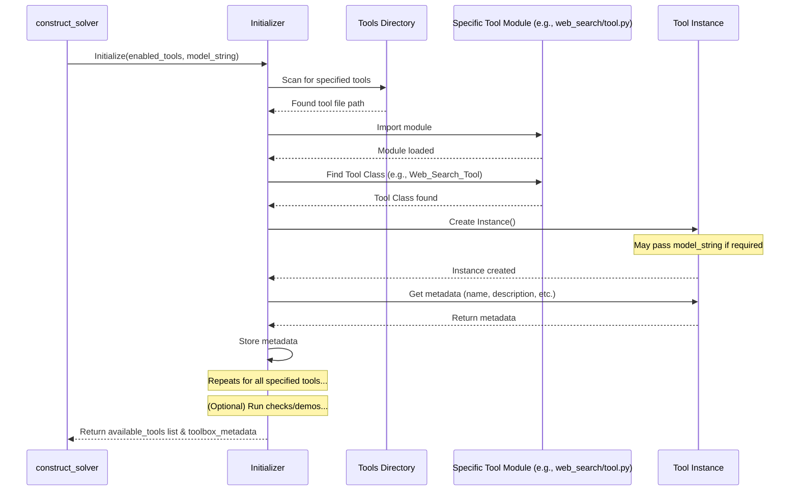

# Chapter 7: Initializer

Welcome back! In the previous chapters, we explored the key players in `octotools`: the coordinator ([Solver](01_solver_.md)), the AI brain ([LLM Engine](02_llm_engine_.md)), the specialized equipment ([Tool](03_tool_.md)), the logbook ([Memory](04_memory_.md)), the strategist ([Planner](05_planner_.md)), and the operator ([Executor](06_executor_.md)). They all work together to solve your problem.

But before the main show (the [Solver](01_solver_.md) starting its work) can begin, someone needs to set the stage! Imagine you're starting a big construction project. Before the builders ([Solver](01_solver_.md)) arrive, a setup crew comes in. They check the inventory, make sure all the required machines (like excavators, cranes - our [Tool](03_tool_.md)s) are present, working, and have their instruction manuals ready.

That's exactly what the **Initializer** does in `octotools`!

## What is the Initializer?

The **Initializer** is the **Setup Crew** for your `octotools` project. Its main job is to prepare the environment *before* the [Solver](01_solver_.md) starts tackling the problem. It ensures that all the necessary [Tool](03_tool_.md)s are identified, understood, and ready for use.

Specifically, the Initializer is responsible for:

1.  **Discovering Tools:** It scans the `octotools` project to find all the available [Tool](03_tool_.md)s (like `Web_Search_Tool`, `Image_Captioner_Tool`, etc.). You can tell it which specific tools you want to use or ask it to find all of them.
2.  **Loading Metadata:** For each discovered tool, it loads important information (the "instruction manual" or metadata) such as:
    *   Its name (`tool_name`).
    *   What it does (`tool_description`).
    *   What inputs it needs (`input_types`).
    *   What output it produces (`output_type`).
    *   Whether it needs help from an [LLM Engine](02_llm_engine_.md) (`require_llm_engine`).
3.  **Checking Availability (Optional):** It might run simple checks or "demo commands" for each tool to make sure it's actually working correctly in your environment (e.g., does the Web Search tool have the necessary API key?). This step helps filter out tools that might be present in the code but aren't usable right now.

By the time the Initializer is finished, the [Solver](01_solver_.md) (and specifically the [Planner](05_planner_.md) and [Executor](06_executor_.md)) will have a neat list of verified, ready-to-use tools along with all the details needed to operate them.

## How is the Initializer Used? (Mostly Behind the Scenes)

As a beginner user, you usually won't call the `Initializer` directly. It's typically handled for you when you set up the main [Solver](01_solver_.md) using the `construct_solver` function we saw in [Chapter 1: Solver](01_solver_.md).

Remember this code from Chapter 1?

```python
# From Chapter 1 - Setting up the Solver
from octotools.solver import construct_solver

# --- Parameters ---
llm_engine = "gpt-4o-mini"
# HERE: You tell construct_solver which tools to consider
tools_to_use = ["Web_Search_Tool", "Image_Captioner_Tool"]
show_details = True

# --- Create the Solver ---
# The Initializer runs INSIDE construct_solver!
my_solver = construct_solver(
    llm_engine_name=llm_engine,
    enabled_tools=tools_to_use, # This list is passed to the Initializer
    verbose=show_details
)

# ... rest of the code ...
```

**Explanation:**

When you call `construct_solver(...)`, you pass the `enabled_tools` list. Behind the scenes, `construct_solver` uses the `Initializer` and gives it this list. The `Initializer` then performs its discovery and loading process for *only* the tools you specified (or all tools if you pass `["all"]`). The results from the `Initializer` (the list of available tools and their metadata) are then used to configure the [Planner](05_planner_.md) and [Executor](06_executor_.md) within the `my_solver` object.

So, while you don't type `Initializer.run()`, you are controlling its behavior through the parameters you pass to `construct_solver`.

## Under the Hood: The Setup Process

Let's peek behind the curtain to see how the Initializer (our Setup Crew) gets everything ready.

**1. Non-Code Walkthrough: Finding and Checking Tools**

Imagine `construct_solver` calls the `Initializer` with `enabled_tools = ["Web_Search_Tool", "Calculator_Tool"]`.

1.  **Receive Instructions:** The `Initializer` gets the list `["Web_Search_Tool", "Calculator_Tool"]` and the name of the [LLM Engine](02_llm_engine_.md) to be used (e.g., "gpt-4o-mini"), in case some tools need it.
2.  **Scan Tool Shed:** It looks inside the `octotools/tools/` directory for subdirectories matching the names in the list (like `web_search/` and `calculator/`).
3.  **Inspect Web Search Tool:**
    *   It finds `octotools/tools/web_search/tool.py`.
    *   It imports this file.
    *   It finds the class named `Web_Search_Tool` inside.
    *   It creates an instance (object) of this class: `tool_instance = Web_Search_Tool()`.
    *   It reads metadata from the instance: `tool_instance.tool_name`, `tool_instance.tool_description`, etc.
    *   It stores this metadata, associated with the name `Web_Search_Tool`.
4.  **Inspect Calculator Tool:**
    *   It finds `octotools/tools/calculator/tool.py`.
    *   It imports it, finds the `Calculator_Tool` class.
    *   It creates an instance: `tool_instance = Calculator_Tool()`.
    *   It reads and stores its metadata.
5.  **Run Checks (Optional Demo):**
    *   It might try a simple action with `Web_Search_Tool` (like a predefined demo search) to ensure it doesn't immediately crash (e.g., due to a missing API key). If it fails, it might mark `Web_Search_Tool` as unavailable.
    *   It does the same for `Calculator_Tool`.
6.  **Final Report:** The `Initializer` finishes and provides two key pieces of information back to `construct_solver`:
    *   `available_tools`: The final list of tools that were found *and* passed the checks (e.g., `["Web_Search_Tool", "Calculator_Tool"]` if both worked).
    *   `toolbox_metadata`: A dictionary containing the detailed metadata for each available tool.

This information is then used to properly set up the [Planner](05_planner_.md) (so it knows which tools to consider) and the [Executor](06_executor_.md) (so it knows how to load and run them).

**2. Sequence Diagram: Initializer at Work**

This diagram shows the basic flow when `construct_solver` uses the `Initializer`.



**3. Code Dive (`octotools/models/initializer.py`)**

Let's look at simplified snippets from the `Initializer` class.

*   **Initialization (`__init__`)**

    This sets up the Initializer and starts the process by calling `_set_up_tools`.

    ```python
    # Simplified from octotools/models/initializer.py
    from typing import Dict, Any, List

    class Initializer:
        def __init__(self, enabled_tools: List[str] = [], model_string: str = None, verbose: bool = False):
            self.toolbox_metadata = {} # Where metadata will be stored
            self.available_tools = []  # Final list of usable tools
            self.enabled_tools = enabled_tools # List from user/construct_solver
            self.load_all = self.enabled_tools == ["all"] # Should we find all tools?
            self.model_string = model_string # LLM name (for tools that need it)
            self.verbose = verbose

            print("\n==> Initializing octotools...")
            if self.verbose:
                print(f"Requested tools: {self.enabled_tools}")
                print(f"LLM engine name: {self.model_string}")

            # Start the main setup process
            self._set_up_tools()
    ```
    **Explanation:** The `__init__` method primarily stores the configuration passed to it (like `enabled_tools` and `model_string`). It then immediately calls the internal `_set_up_tools` method to begin the discovery and loading process.

*   **Setting Up Tools (`_set_up_tools`)**

    This method orchestrates the main steps: loading metadata and running checks.

    ```python
    # Simplified from octotools/models/initializer.py
    class Initializer:
        # ... __init__ ...

        def _set_up_tools(self) -> None:
            print("\n==> Setting up tools...")

            # 1. Figure out which tool names to look for initially
            # (Simplified - actual code normalizes names)
            potential_tools = self.enabled_tools # Or logic to find all if self.load_all

            # 2. Load metadata for potential tools
            # (Passes potential_tools list to guide the loading)
            self.load_tools_and_get_metadata(potential_tools)

            # 3. Run checks/demos to confirm availability
            # (This updates self.available_tools)
            self.run_demo_commands()

            # 4. Filter the loaded metadata to keep only the truly available tools
            self.toolbox_metadata = {
                tool_name: meta
                for tool_name, meta in self.toolbox_metadata.items()
                if tool_name in self.available_tools
            }

            print("✅ Finished setting up tools.")
            if self.verbose:
                print(f"✅ Final available tools: {self.available_tools}")
    ```
    **Explanation:** This method acts as a high-level coordinator. It calls `load_tools_and_get_metadata` to gather information about the tools and then `run_demo_commands` to verify them. Finally, it ensures that `self.toolbox_metadata` only contains entries for the tools that passed verification (`self.available_tools`).

*   **Loading Metadata (`load_tools_and_get_metadata`)**

    This is where the core discovery happens: scanning, importing, instantiating, and reading metadata.

    ```python
    # Simplified from octotools/models/initializer.py
    import importlib # For loading code dynamically
    import inspect   # For finding classes in modules
    import os        # For finding tool directories

    class Initializer:
        # ... __init__, _set_up_tools ...

        def load_tools_and_get_metadata(self, potential_tools: List[str]) -> None:
            print("Loading tools and getting metadata...")
            self.toolbox_metadata = {} # Reset metadata storage
            tools_base_dir = "octotools/tools" # Directory where tools live

            # Loop through the names of tools we might want to load
            for tool_name in potential_tools:
                # Simplified: Construct the expected module path
                tool_folder_name = tool_name.lower().replace('_tool', '')
                module_path = f"octotools.tools.{tool_folder_name}.tool"
                expected_class_name = tool_name # e.g., "Web_Search_Tool"

                try:
                    # Try to import the tool's code
                    module = importlib.import_module(module_path)
                    print(f"  Successfully imported {module_path}")

                    # Find the class within the imported module
                    tool_class = getattr(module, expected_class_name)

                    # Create an instance of the tool class
                    # Check if it needs the LLM engine name during creation
                    if getattr(tool_class, 'require_llm_engine', False):
                        tool_instance = tool_class(model_string=self.model_string)
                    else:
                        tool_instance = tool_class()
                    print(f"    Instantiated {expected_class_name}")

                    # Extract metadata from the instance
                    metadata = {
                        'tool_name': getattr(tool_instance, 'tool_name', 'N/A'),
                        'tool_description': getattr(tool_instance, 'tool_description', 'N/A'),
                        'input_types': getattr(tool_instance, 'input_types', {}),
                        'output_type': getattr(tool_instance, 'output_type', 'N/A'),
                        'require_llm_engine': getattr(tool_class, 'require_llm_engine', False),
                        # ... other metadata fields ...
                    }
                    self.toolbox_metadata[expected_class_name] = metadata
                    if self.verbose: print(f"    Metadata loaded for {expected_class_name}")

                except ModuleNotFoundError:
                    print(f"  Warning: Tool module not found: {module_path}")
                except AttributeError:
                     print(f"  Warning: Class {expected_class_name} not found in {module_path}")
                except Exception as e:
                    print(f"  Error loading/instantiating {expected_class_name}: {e}")

            print(f"\n==> Initial metadata loaded for {len(self.toolbox_metadata)} tools.")
    ```
    **Explanation:** This function iterates through the list of requested `potential_tools`. For each one, it tries to:
    1.  Import the corresponding Python module (e.g., `octotools.tools.web_search.tool`).
    2.  Find the class with the matching name (e.g., `Web_Search_Tool`).
    3.  Create an object (instance) of that class, passing the `model_string` if the tool requires it.
    4.  Read attributes like `tool_name`, `tool_description` from the created object to get the metadata.
    5.  Store this metadata in the `self.toolbox_metadata` dictionary.
    It includes error handling (`try...except`) to gracefully skip tools that can't be loaded for any reason.

*   **Running Demo Commands (`run_demo_commands`)**

    This (simplified) method attempts to instantiate each tool found in the previous step to verify it's basically functional. It updates `self.available_tools`.

    ```python
    # Simplified from octotools/models/initializer.py
    import importlib
    import traceback # For detailed error logging

    class Initializer:
        # ... __init__, _set_up_tools, load_tools_and_get_metadata ...

        def run_demo_commands(self) -> None:
            print("\n==> Verifying tool availability...")
            self.available_tools = [] # Reset the list of confirmed tools

            # Check each tool for which we loaded metadata
            for tool_name in self.toolbox_metadata.keys():
                print(f"  Checking {tool_name}...")
                try:
                    # Re-import and try to instantiate again (basic check)
                    # (Simplified - actual code might run actual demo commands)
                    tool_folder_name = tool_name.lower().replace('_tool', '')
                    module_path = f"octotools.tools.{tool_folder_name}.tool"
                    module = importlib.import_module(module_path)
                    tool_class = getattr(module, tool_name)

                    # Try creating instance again (confirms basic setup works)
                    if getattr(tool_class, 'require_llm_engine', False):
                         _ = tool_class(model_string=self.model_string)
                    else:
                         _ = tool_class()

                    # If instantiation worked, add it to the list of available tools
                    self.available_tools.append(tool_name)
                    print(f"    ✅ {tool_name} is available.")

                except Exception as e:
                    # If any error occurs during this check, mark tool as unavailable
                    print(f"    ❌ Error checking {tool_name}: {e}")
                    if self.verbose: print(traceback.format_exc())

            print("\n✅ Finished verifying tool availability.")
    ```
    **Explanation:** This function iterates through the tools that had metadata loaded (`self.toolbox_metadata.keys()`). For each one, it performs a basic check (here, just trying to instantiate it again). If the check succeeds without errors, the tool's name is added to the `self.available_tools` list. If any error occurs, the tool is considered unavailable for this run. This step ensures that the [Solver](01_solver_.md) only tries to use tools that are confirmed to be functional in the current environment.

## Conclusion

The **Initializer** is the unsung hero that works behind the scenes before the [Solver](01_solver_.md) even starts. Like a meticulous setup crew, it scans for the requested [Tool](03_tool_.md)s, gathers their vital statistics (metadata), and performs basic checks to ensure they are ready for action. This preparation phase is crucial because it provides the [Planner](05_planner_.md) and [Executor](06_executor_.md) with a reliable inventory of capabilities, allowing the main problem-solving process to run smoothly.

You now understand how `octotools` gets ready to tackle a new challenge!

## Next Steps

We've seen how tools are discovered and how the system interacts with them. But sometimes, the data coming out of a tool or going into the [LLM Engine](02_llm_engine_.md) needs a bit of reformatting to be useful. How does `octotools` handle structuring and cleaning up data for different components?

Let's explore this in the next chapter: **[Data Formatters](08_data_formatters_.md)**.

---

Generated by [AI Codebase Knowledge Builder](https://github.com/The-Pocket/Tutorial-Codebase-Knowledge)