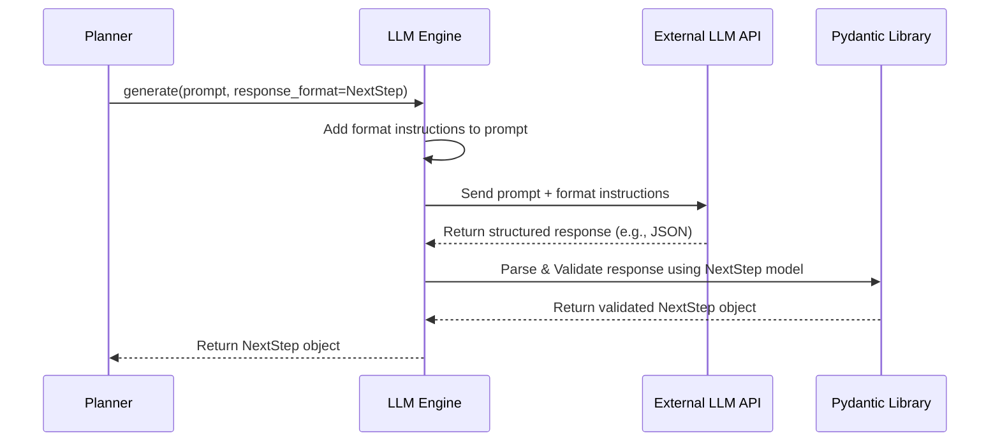

# Chapter 8: Data Formatters

Welcome back! In [Chapter 7: Initializer](07_initializer_.md), we saw how `octotools` prepares the stage by discovering and checking the available [Tool](03_tool_.md)s before the main problem-solving begins. Now, let's think about how different parts of the system talk to each other, especially when the powerful but sometimes unpredictable [LLM Engine](02_llm_engine_.md) is involved.

Imagine the [Planner](05_planner_.md) asking the [LLM Engine](02_llm_engine_.md): "What's the next step and which tool should I use?". The LLM might answer in many ways:

*   "Use the Web_Search_Tool to find the capital."
*   "Next step: Search the web for the capital. Tool: Web_Search_Tool."
*   "I think you should probably use the web search tool next, maybe to find the capital city?"

While a human can understand these, a computer program needs consistency. If the [Planner](05_planner_.md) expects the tool name *first*, but the LLM gives the explanation *first*, the program might get confused or crash. How can we ensure clear, reliable communication?

That's where **Data Formatters** come in!

## What are Data Formatters?

Think of **Data Formatters** like **standardized forms or templates**. When you fill out a form (like for a library card), you know exactly where to put your name, address, and phone number. There are specific boxes for specific pieces of information.

Data Formatters in `octotools` do the same thing for the information exchanged between components, especially when talking to the [LLM Engine](02_llm_engine_.md). They define a **structured way** to organize data.

`octotools` uses a popular Python library called **Pydantic** to create these templates. Pydantic allows us to define simple classes that act as blueprints for our data.

Some key "forms" (Data Formatters) used in `octotools` include:

*   `NextStep`: Used by the [Planner](05_planner_.md) to get the next sub-goal and tool name from the LLM. It has fields like `sub_goal` and `tool_name`.
*   `ToolCommand`: Used by the [Executor](06_executor_.md) to get the exact Python command for a tool from the LLM. It has a field like `command`.
*   `QueryAnalysis`: Used by the [Planner](05_planner_.md) at the beginning to understand the user's request. Fields might include `concise_summary` and `required_skills`.
*   `MemoryVerification`: Used by the [Planner](05_planner_.md) to check if the task is finished. Has a field like `stop_signal` (True or False).

By using these formatters, we ensure that when the [LLM Engine](02_llm_engine_.md) provides information (like the next step), it fills out the "form" correctly, putting the right information in the right "box." This makes the data easy and reliable for other parts of the system (like the [Planner](05_planner_.md) or [Executor](06_executor_.md)) to understand and use.

## How are Data Formatters Used?

Components like the [Planner](05_planner_.md) or [Executor](06_executor_.md) don't just hope the [LLM Engine](02_llm_engine_.md) gives back structured data. They actually *tell* the LLM Engine what format they expect!

When making a request to the [LLM Engine](02_llm_engine_.md), they can specify the desired Data Formatter (like `NextStep`). The `LLM Engine` (often with help from the underlying AI model's capabilities) then tries its best to generate a response that fits that exact structure.

Let's see a simplified example of how the [Planner](05_planner_.md) might ask the [LLM Engine](02_llm_engine_.md) for the next step, specifically requesting the output be formatted as a `NextStep` object.

```python
# Assume 'planner_llm_engine' is an instance of an LLM Engine
# Assume 'prompt_asking_for_next_step' contains the detailed request
# Import the specific "form" we want the LLM to fill out
from octotools.models.formatters import NextStep

print("Planner: Asking LLM for the next step (expecting NextStep format)...")

# Make the call to the LLM, specifying the desired response format
# (Simplified - the actual mechanism might vary slightly)
structured_response = planner_llm_engine.generate(
    prompt_asking_for_next_step,
    response_format=NextStep # Tell the engine we want a NextStep object back
)

# --- Check the Result ---
if isinstance(structured_response, NextStep):
    print("\nSuccess! Received structured data:")
    print(f"  - Justification: {structured_response.justification}")
    print(f"  - Context: {structured_response.context}")
    print(f"  - Sub-Goal: {structured_response.sub_goal}")
    print(f"  - Tool Name: {structured_response.tool_name}")
else:
    print("\nFailed to get structured data. Response:")
    print(structured_response)

```

**Explanation:**

1.  We import the `NextStep` formatter class.
2.  When the `Planner` calls `planner_llm_engine.generate(...)`, it adds an important argument: `response_format=NextStep`. This tells the [LLM Engine](02_llm_engine_.md) (and the underlying AI model) to structure its answer according to the `NextStep` template.
3.  If the LLM successfully follows the instructions, the `structured_response` variable will contain an actual `NextStep` object (not just plain text).
4.  The `Planner` can then reliably access the specific pieces of information using dot notation (e.g., `structured_response.sub_goal`, `structured_response.tool_name`) because it knows the "form" has been filled out correctly.

## Under the Hood

How does this "fill out the form" magic happen?

**1. Non-Code Walkthrough: Instructing the LLM**

1.  **Component Request:** The [Planner](05_planner_.md) decides it needs the next step.
2.  **Format Specification:** It tells the [LLM Engine](02_llm_engine_.md), "I need the answer formatted like the `NextStep` template, which has fields for `justification`, `context`, `sub_goal`, and `tool_name`."
3.  **LLM Engine Action:** The [LLM Engine](02_llm_engine_.md) takes the original prompt (e.g., "Based on the history, what's next?") and adds instructions about the required `NextStep` format. This might involve telling the underlying AI model about the fields and their types.
4.  **AI Processing:** The AI model (like GPT-4o) processes the combined request. It generates the content for the next step *and* structures it according to the requested format (e.g., outputting something like JSON that matches the `NextStep` fields).
5.  **Parsing & Validation:** The [LLM Engine](02_llm_engine_.md) receives the structured response from the AI. It uses Pydantic to parse this response and validate that it correctly matches the `NextStep` definition (e.g., all required fields are present, types are correct).
6.  **Return Structured Object:** If validation succeeds, the [LLM Engine](02_llm_engine_.md) returns the validated `NextStep` object (the filled-out "form") back to the [Planner](05_planner_.md).

**2. Sequence Diagram: Requesting Structured Output**



**3. Code Dive (`octotools/models/formatters.py`)**

Let's look at how these "forms" or "templates" are defined using Pydantic.

```python
# Simplified from octotools/models/formatters.py
# Import the base class from Pydantic
from pydantic import BaseModel

# Define the "NextStep" form template
class NextStep(BaseModel):
    """Structure for the Planner to decide the next step."""
    # Define the fields (boxes) and their expected data types
    justification: str # Expects a string (text)
    context: str       # Expects a string
    sub_goal: str      # Expects a string
    tool_name: str     # Expects a string

# Define the "ToolCommand" form template
class ToolCommand(BaseModel):
    """Structure for the Executor to get the tool command."""
    # Define the fields (boxes)
    analysis: str      # Expects a string
    explanation: str   # Expects a string
    command: str       # Expects a string (the Python code)

# --- How Pydantic helps ---
# Example of creating a ToolCommand object manually
# (The LLM Engine does this automatically when parsing)
command_data = {
    "analysis": "Need to search the web.",
    "explanation": "Using the web search tool to find the capital.",
    "command": "execution = tool.execute(query='Capital of France')"
}
try:
    tool_cmd_obj = ToolCommand(**command_data) # Pydantic validates the data!
    print("\nCreated ToolCommand object:")
    print(f"  Command: {tool_cmd_obj.command}")
except Exception as e:
    print(f"Error creating ToolCommand: {e}") # Pydantic would raise error if data was wrong
```

**Explanation:**

1.  We import `BaseModel` from the `pydantic` library.
2.  Each formatter (like `NextStep` or `ToolCommand`) is defined as a class that inherits from `BaseModel`.
3.  Inside each class, we list the fields (like `justification`, `sub_goal`, `command`) and specify the expected data type after the colon (`:`), like `str` for text (string).
4.  This definition acts as the blueprint. When the [LLM Engine](02_llm_engine_.md) receives data from the AI that's supposed to match `ToolCommand`, Pydantic uses this blueprint to automatically check if the data has the correct fields (`analysis`, `explanation`, `command`) and if they contain strings. If anything is wrong (e.g., a field is missing, or `command` contains a number instead of text), Pydantic raises an error, helping catch problems early.

## Benefits of Data Formatters

Using these structured Data Formatters provides several advantages:

*   **Consistency:** Ensures data is always in the same layout, regardless of how the LLM phrases its response.
*   **Reliability:** Makes parsing data much easier and less prone to errors compared to trying to extract information from free-form text.
*   **Clarity:** Defines exactly what information is expected for different tasks.
*   **Validation:** Pydantic automatically checks if the received data matches the expected structure and types.

## Conclusion

Data Formatters are the unsung heroes of reliable communication within `octotools`, especially when interacting with the [LLM Engine](02_llm_engine_.md). By defining structured templates (like `NextStep` or `ToolCommand`) using Pydantic, `octotools` ensures that information is exchanged consistently and can be easily parsed and validated. Think of them as standardized forms that keep communication clear and prevent misunderstandings between the different components, leading to a more robust and predictable system.

## Next Steps

We've seen how `octotools` uses AI ([LLM Engine](02_llm_engine_.md)), specialized capabilities ([Tool](03_tool_.md)), memory ([Memory](04_memory_.md)), planning ([Planner](05_planner_.md)), execution ([Executor](06_executor_.md)), setup ([Initializer](07_initializer_.md)), and structured data ([Data Formatters](08_data_formatters_.md)). One important aspect we touched on in the [LLM Engine](02_llm_engine_.md) chapter was efficiency. How can we avoid asking the LLM the same question repeatedly, saving time and potentially cost?

Let's dive deeper into how `octotools` optimizes performance using caching in the next chapter: **[Caching (`CachedEngine`)](09_caching___cachedengine___.md)**.

---

Generated by [AI Codebase Knowledge Builder](https://github.com/The-Pocket/Tutorial-Codebase-Knowledge)