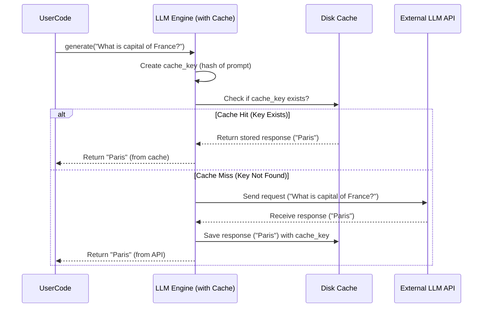

# Chapter 9: Caching (`CachedEngine`)

Welcome back! In the previous chapter, **[Data Formatters](08_data_formatters_.md)**, we saw how `octotools` uses structured templates to ensure reliable communication, especially with the [LLM Engine](02_llm_engine_.md). Now, let's think about efficiency.

Imagine you're asking the [LLM Engine](02_llm_engine_.md) the same question multiple times, perhaps during testing or as part of a repeating workflow. For example, you might ask, "What is the capital of France?" today, and again tomorrow. Each time, the engine sends your request over the internet to the AI provider (like OpenAI or Anthropic), waits for the response, and uses up some of your API credits or budget. This takes time and costs money. Wouldn't it be great if the engine could *remember* the answer it gave you last time?

This is exactly the problem that **Caching** solves!

## What is Caching (`CachedEngine`)?

Think of **Caching** like keeping a **sticky note** with a frequently needed answer right next to your computer. If you need to know the capital of France, instead of looking it up online *every single time*, you first check your sticky note. If the answer ("Paris") is already written there, you use it directly. This is much faster and doesn't require you to use your internet connection (or API credits). You only look it up online the *first* time, and then you write it on the note for future use.

In `octotools`, Caching works similarly:

1.  **Store Results:** When you make a request (like a prompt) to an [LLM Engine](02_llm_engine_.md) that has caching enabled, the engine stores a copy of your request and the response it received from the external AI service.
2.  **Check First:** The *next* time you make the *exact same request* to that engine, it first checks its internal storage (the "cache").
3.  **Return Stored Answer:** If it finds a saved response for that exact request, it returns the stored answer immediately, without contacting the external AI service.
4.  **Fetch if New:** If the request is new (not found in the cache), the engine contacts the external AI service as usual, gets the response, saves it to the cache for next time, and then returns it to you.

This mechanism significantly speeds up repeated requests and reduces the number of paid calls to the LLM API, saving you time and money. The component that provides this functionality within `octotools` LLM engines is called `CachedEngine`.

## How Caching is Used

You don't usually interact with `CachedEngine` directly. Instead, you enable caching when you create an instance of an [LLM Engine](02_llm_engine_.md) using the factory function we saw in [Chapter 2: LLM Engine](02_llm_engine_.md).

Let's revisit the example from Chapter 2, but focus on the caching aspect.

```python
# Import the factory function
from octotools.engine.factory import create_llm_engine
import time # Import time to measure speed

# --- Configuration ---
# Specify the model name
model_name = "gpt-4o-mini-2024-07-18" # Example model

# --- Create the Engine WITH Caching Enabled ---
print(f"Creating engine for model: {model_name} (Caching: ON)")
llm_engine = create_llm_engine(
    model_string=model_name,
    use_cache=True # <<< This is the key part!
)
print("Engine created!")

# --- Ask the Engine a Question (First Time) ---
question = "What is the main benefit of caching in software?"
print(f"\nAsking the engine (1st time): {question}")

start_time = time.time()
response1 = llm_engine.generate(question)
end_time = time.time()
print(f"Response 1 received in {end_time - start_time:.2f} seconds.")
print(f"Response 1: {response1[:100]}...") # Show first 100 chars

# --- Ask Again (Should use Cache) ---
print(f"\nAsking the *same* question again (2nd time): {question}")

start_time_cached = time.time()
response2 = llm_engine.generate(question) # Same question again
end_time_cached = time.time()
print(f"Response 2 received in {end_time_cached - start_time_cached:.4f} seconds.") # Note more decimal places
print(f"Response 2: {response2[:100]}...")

# Verify the responses are identical
print(f"\nAre responses identical? {response1 == response2}")
```

**Explanation:**

1.  We create the `llm_engine` using `create_llm_engine`, crucially setting `use_cache=True`. This tells the factory to build an engine that includes the `CachedEngine` functionality.
2.  We ask the `question` the first time using `llm_engine.generate()`. Behind the scenes, the engine contacts the external LLM (like GPT-4o mini), gets the answer, **saves the answer to its cache**, and returns it. We measure how long this takes.
3.  We ask the *exact same question* again. This time, the `llm_engine` first checks its cache. It finds the saved answer for this question. It **returns the cached answer directly** without contacting the external LLM.
4.  You should observe that the second call is *significantly faster* than the first call (often milliseconds instead of seconds). The responses should also be identical.

*(Note: The cache is typically stored as a file on your computer, often in a user cache directory. This means the cache persists even if you restart your script, as long as you use the same model and cache path.)*

## Under the Hood: How `CachedEngine` Works

Let's look closer at what happens inside an engine when `use_cache=True`.

**1. Non-Code Walkthrough: The Cache Check Process**

When you call `engine.generate(prompt)`:

1.  **Create Cache Key:** The engine takes the `prompt` (and often other relevant details like the system prompt if one is used) and creates a unique identifier, usually by "hashing" it. Hashing turns the potentially long input text into a fixed-size, unique string (like a fingerprint). Let's call this the `cache_key`.
2.  **Check Storage:** The engine accesses its cache storage (managed by the `diskcache` library, which writes to files). It checks if there's an entry stored under this specific `cache_key`.
3.  **Cache Hit:** If the `cache_key` exists in the storage:
    *   The engine retrieves the saved response associated with that key.
    *   It immediately returns this saved response. (Fast!)
4.  **Cache Miss:** If the `cache_key` does *not* exist in the storage:
    *   The engine proceeds to contact the external LLM API with the original `prompt`.
    *   It receives the response from the API.
    *   **Crucially:** Before returning the response, it saves it to the cache storage, associating it with the `cache_key` generated in step 1.
    *   Finally, it returns the newly received response. (Slower, involves API call).

**2. Sequence Diagram: Cache Hit vs. Cache Miss**



**3. Code Dive**

*   **The Base Class (`octotools/engine/base.py`)**

    The core caching logic is provided by the `CachedEngine` class, which other engine classes (like `ChatOpenAI`, `ChatAnthropic`) inherit from if caching is enabled.

    ```python
    # Simplified from octotools/engine/base.py
    import hashlib # For creating the cache key fingerprint
    import diskcache as dc # The library for file-based caching
    from abc import ABC, abstractmethod

    # Basic definition for any LLM engine
    class EngineLM(ABC):
        @abstractmethod
        def generate(self, prompt, **kwargs):
            pass
        # ... other common methods ...

    # Mixin class providing caching functionality
    class CachedEngine:
        def __init__(self, cache_path):
            """Initializes the disk cache."""
            super().__init__() # Important for multiple inheritance
            self.cache_path = cache_path
            # Create a cache object linked to a file path
            # `diskcache` handles reading/writing efficiently
            self.cache = dc.Cache(cache_path)
            print(f"  Cache initialized at: {cache_path}")

        def _hash_prompt(self, prompt: str) -> str:
            """Creates a unique, fixed-size key from the prompt."""
            # SHA-256 is a common hashing algorithm
            return hashlib.sha256(f"{prompt}".encode()).hexdigest()

        def _check_cache(self, prompt: str):
            """Checks if a response exists in the cache for this prompt."""
            # Use the hashed prompt as the key
            # cache_key = self._hash_prompt(prompt) # Or just use prompt directly if safe
            cache_key = prompt # diskcache can often handle string keys directly
            if cache_key in self.cache:
                print("    CACHE HIT!") # Indicate cache was used
                return self.cache[cache_key] # Return the stored value
            print("    CACHE MISS.")
            return None # Not found

        def _save_cache(self, prompt: str, response: Any):
            """Saves a response to the cache."""
            # cache_key = self._hash_prompt(prompt)
            cache_key = prompt
            self.cache[cache_key] = response # Store the key-value pair
            print("    SAVED TO CACHE.")
        # ... methods to handle saving/loading engine state without the cache object ...
    ```

    **Explanation:**
    *   `CachedEngine` is designed to be mixed in with specific engine classes.
    *   `__init__`: Takes a file `cache_path` and creates a `diskcache.Cache` object. This object manages storing and retrieving data from a file (or set of files) at that path.
    *   `_hash_prompt` (Optional but good practice): Shows how to create a consistent "fingerprint" (`cache_key`) for a given prompt using hashing. (Note: `diskcache` can often use strings directly as keys, so sometimes the raw prompt combined with other relevant info is used as the key).
    *   `_check_cache`: Takes a prompt (or the generated `cache_key`), checks if it exists as a key in the `self.cache` object using Python's `in` operator, and returns the stored value if found, otherwise `None`.
    *   `_save_cache`: Takes a prompt (or `cache_key`) and the `response`, and stores them in the `self.cache` object like assigning to a dictionary (`self.cache[key] = value`).

*   **Using the Cache in a Specific Engine (e.g., `octotools/engine/openai.py`)**

    Specific engine classes like `ChatOpenAI` use these `_check_cache` and `_save_cache` methods within their `generate` logic.

    ```python
    # Simplified from octotools/engine/openai.py
    from .base import EngineLM, CachedEngine
    import platformdirs
    import os

    class ChatOpenAI(EngineLM, CachedEngine): # Inherits from both
        DEFAULT_SYSTEM_PROMPT = "You are helpful..."

        def __init__(self, model_string="gpt-4o-mini...", use_cache=True, system_prompt=None, **kwargs):
            self.model_string = model_string
            self.use_cache = use_cache
            self.system_prompt = system_prompt or self.DEFAULT_SYSTEM_PROMPT
            # ... other setup like OpenAI client ...

            if self.use_cache:
                # Define where to store the cache file for this specific model
                root = platformdirs.user_cache_dir("octotools")
                cache_path = os.path.join(root, f"cache_openai_{self.model_string}.db")
                # Call the CachedEngine's __init__ to set up self.cache
                super().__init__(cache_path=cache_path)
            # ... setup OpenAI client ...
            print("ChatOpenAI engine ready.")

        def _generate_text(self, prompt, system_prompt=None, **kwargs):
            # Determine the effective system prompt
            sys_prompt_arg = system_prompt if system_prompt else self.system_prompt

            # --- Caching Logic ---
            cache_key = None
            if self.use_cache:
                # Create a key combining system prompt and user prompt
                cache_key = sys_prompt_arg + prompt
                cached_result = self._check_cache(cache_key) # Check the cache first!
                if cached_result is not None:
                    return cached_result # Return directly if found
            # --- End Caching Logic ---

            # --- If Cache Miss (or cache disabled), call API ---
            print("    Calling OpenAI API...")
            # ... (Code to prepare messages for OpenAI API call) ...
            messages = [
                {"role": "system", "content": sys_prompt_arg},
                {"role": "user", "content": prompt},
            ]
            # ... (Make the actual API call using self.client) ...
            # response = self.client.chat.completions.create(...) # API call
            # result_text = response.choices[0].message.content # Extract text
            result_text = f"API response for: {prompt}" # Dummy response for example

            # --- Caching Logic ---
            if self.use_cache and cache_key is not None:
                self._save_cache(cache_key, result_text) # Save the new result
            # --- End Caching Logic ---

            return result_text

        # Need the main generate method to delegate
        def generate(self, content: Union[str, List], system_prompt=None, **kwargs):
            # Simplified: Assume text input for this example
            if isinstance(content, str):
                return self._generate_text(content, system_prompt=system_prompt, **kwargs)
            else:
                 # Handle multimodal or list inputs (might have own caching logic)
                 # ... (multimodal generation and caching) ...
                 return "Multimodal/List handling not shown in this simplification."

        def __call__(self, prompt, **kwargs):
            return self.generate(prompt, **kwargs)

    ```

    **Explanation:**
    1.  The `ChatOpenAI` class inherits from both `EngineLM` (for the basic `generate` requirement) and `CachedEngine` (for the caching methods).
    2.  In `__init__`, if `use_cache` is `True`, it determines a unique `cache_path` for this specific OpenAI model and calls `super().__init__(cache_path=...)`. This invokes the `CachedEngine.__init__` method, setting up the `self.cache` object.
    3.  Inside the `_generate_text` method (which handles the actual work for text prompts):
        *   It first checks `if self.use_cache:`.
        *   If true, it creates a `cache_key` (here, simply concatenating the system and user prompts).
        *   It calls `self._check_cache(cache_key)`.
        *   If `_check_cache` returns something other than `None` (a cache hit), the function returns that cached value immediately.
        *   If it was a cache miss (or caching is off), the code proceeds to make the actual API call to OpenAI.
        *   After getting the `result_text` from the API, it again checks `if self.use_cache:` and calls `self._save_cache(cache_key, result_text)` to store the new result before returning it.

This pattern ensures that the caching logic seamlessly wraps the actual API call, checking before and saving after, without cluttering the core API interaction code too much.

## Conclusion

Caching, provided by the `CachedEngine` component within `octotools` [LLM Engine](02_llm_engine_.md)s, is a powerful technique for improving performance and reducing costs. By storing the results of previous LLM API calls and reusing them when the same request occurs again, it acts like a smart assistant with a good memory (or a handy sticky note!). Enabling caching via the `use_cache=True` flag when creating an engine is a simple way to make your interactions with LLMs faster and more efficient, especially for repeated tasks.

This concludes our tour through the core concepts of `octotools`! We hope these chapters have given you a solid foundation for understanding how the different pieces ([Solver](01_solver_.md), [LLM Engine](02_llm_engine_.md), [Tool](03_tool_.md), [Memory](04_memory_.md), [Planner](05_planner_.md), [Executor](06_executor_.md), [Initializer](07_initializer_.md), [Data Formatters](08_data_formatters_.md), and Caching) work together.

## Next Steps

You've learned about the building blocks. Now you're ready to:

*   Revisit earlier chapters to solidify your understanding.
*   Experiment with the code examples.
*   Dive into the `octotools` codebase itself to see the full implementations.
*   Start building your own problem-solving agents using `octotools`!

Happy coding!

---

Generated by [AI Codebase Knowledge Builder](https://github.com/The-Pocket/Tutorial-Codebase-Knowledge)