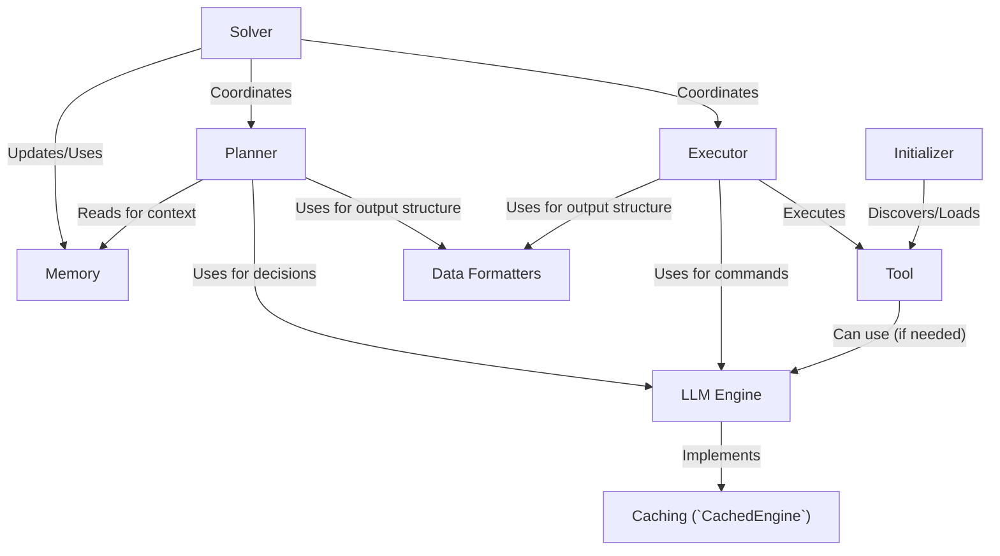

# Tutorial: octotools

`octotools` is a project designed to solve complex problems by breaking them down into smaller steps.
It acts like a **smart agent** that uses different *tools* and *large language models* (LLMs) to figure out the best way to answer a user's query, potentially including an image.
The main **Solver** coordinates the process, using a **Planner** to decide *what* to do next and an **Executor** to figure out *how* to do it with a specific **Tool**.
A **Memory** component keeps track of everything that has happened, while the **LLM Engine** provides the core intelligence and communication with different AI models, optionally using **Caching** to speed things up. **Data Formatters** ensure communication is structured, and an **Initializer** sets everything up.

**Source Repository:** [https://github.com/octotools/octotools](https://github.com/octotools/octotools)

## Chapters

1. [Solver
](01_solver_.md)
2. [LLM Engine
](02_llm_engine_.md)
3. [Tool
](03_tool_.md)
4. [Memory
](04_memory_.md)
5. [Planner
](05_planner_.md)
6. [Executor
](06_executor_.md)
7. [Initializer
](07_initializer_.md)
8. [Data Formatters
](08_data_formatters_.md)
9. [Caching (`CachedEngine`)
](09_caching___cachedengine___.md)

---

Generated by [AI Codebase Knowledge Builder](https://github.com/The-Pocket/Tutorial-Codebase-Knowledge)